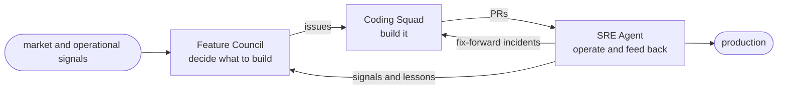

# Dark Software Factory

> An autonomous software factory: software that decides what to build, builds it, and
> keeps it running. People stay outside the process and govern it.

## Why

A "dark factory" in manufacturing runs with the lights off. The line keeps moving and
nobody stands on the floor. Dark Software Factory (DSF) takes that idea to software:
deciding what to build, building it, and operating it all run on agents.

People don't work the line. They stay outside it and do two things:

- Tend the harness: the guardrails, policy, and configuration that keep the agents safe
  and grounded.
- Steer: decide what matters right now, and where to point the factory.

So the job changes. Instead of running the assembly line, you govern the factory around
it. How far that goes is your call; the goal is as much autonomy as each phase can safely
take.

## The loop

DSF runs as a loop of three phases. Each one has a single job, hands off to the next, and
what happens in production comes back to the start.



### Feature Council: decide what to build

It watches operational and market signals and digs into each one against real evidence.
It puts the proposals in front of a council of critics that argue them down, and the ones
that survive get filed as labeled, de-duplicated GitHub issues. The job is to work out
what's worth building.

### Coding Squad: build it

It takes the Council's issues, writes the software, and opens pull requests. A coding
agent does the work, backed by a knowledge base that grows as it goes.

### SRE Agent: operate and feed back

It watches production, sends incidents straight back to the Squad as fixes, and passes
what it learns to the Council as new signals and lessons. It keeps the product running and
teaches the factory how that product actually behaves.

Every product gets its own copy of this loop, fully isolated. No signals, memory, or
context cross between products, so each factory's reasoning stays scoped and easy to audit.

## The harness

Because people sit outside the loop, the factory puts the controls where they can reach
them. You govern the factory, not the assembly line:

- **Control Center** is a live console for turning critics, source agents, and triggers on
  or off, setting per-product confidence thresholds, and flipping the global dry-run kill
  switch that runs the whole line without filing anything.
- **Critic weights** set how much each critic counts toward the council's verdict, and you
  can change them while the line runs.
- **Grounding** forces every claim the factory files to trace back to real evidence. If a
  source is down, you get partial, flagged evidence instead of invented coverage.
- **Policy** is the label taxonomy and routing that connect one phase to the next.
- **Budget** sets the per-run cost caps and de-duplication that keep the line from flooding
  or refiling.

These are the dials you turn to raise or lower autonomy and point the factory's attention.

## One factory per product

This repository is the blueprint, not a factory that's already running. One command stamps
out a complete, isolated factory for a product:

```
dsf new <product>
```

That gives the product its own GitHub repo with a Coding Squad ready to go, a Feature
Council scoped to just that product, an SRE Agent on its production, and a dedicated Azure
resource group behind them, all wired into the loop above. The template and CLI are how
you instantiate it. The factory itself is the loop.

## Where this is going

The work ahead is to push each phase further toward running on its own, as far as it can
safely go, and eventually to let you choose how far to push each one. Right now the three
phases sit at different points along that path.

**Read more:** the
[charter](docs/superpowers/specs/2026-06-17-dark-software-factory-template-charter-design.md)
covers the north-star and roadmap, and architecture decisions live in
[`docs/adr/`](docs/adr/).
