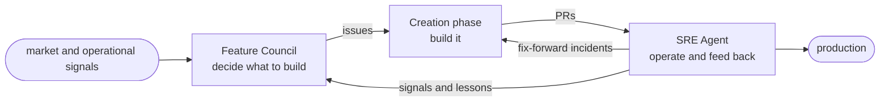

# Dark Software Factory

> An autonomous software factory: software that decides what to build, builds it, and
> keeps it running. People stay outside the process and govern it.

Dark Software Factory (DSF) runs the software development loop on agents: a **Feature
Council** decides what to build, a **Creation phase** builds it, and an **SRE Agent** operates
it and feeds production back to the start. People govern the loop through guardrails, policy,
and configuration. This repository is the blueprint — one command stamps out a complete,
isolated factory per product.


```mermaid
flowchart LR
    signals(["market and operational signals"]) --> FC["Feature Council<br/>decide what to build"]
    FC -->|issues| CS["Creation phase<br/>build it"]
    CS -->|PRs| SRE["SRE Agent<br/>operate and feed back"]
    SRE --> prod(["production"])
    SRE -->|fix-forward incidents| CS
    SRE -->|signals and lessons| FC
```

## Read the docs →

The concept and how-to-use guides live on the documentation site:

**<https://joranbergfeld.github.io/dark-software-factory/>**

Start with the [Quickstart](docs/site/get-started/quickstart.md), then
[provision a factory](docs/site/get-started/provision-a-factory.md),
[operate it](docs/site/get-started/operate.md), and
[verify releases](docs/site/get-started/verify-release.md).

## Install the CLI

Use the packaged .NET tool for normal operator use:

```bash
dotnet tool install --global DarkSoftwareFactory.Cli
# later
dotnet tool update --global DarkSoftwareFactory.Cli
```

Pinned install:

```bash
dotnet tool install --global DarkSoftwareFactory.Cli --version <version>
```

GitHub Releases also publish self-contained archives named
`dsf-cli-<rid>.tar.gz` or `dsf-cli-<rid>.zip` for `linux-x64`, `linux-arm64`,
`osx-x64`, `osx-arm64`, `win-x64`, and `win-arm64`. Extract the archive, put that
directory on `PATH`, and run `dsf`.

## Use DSF

The packaged `dsf` tool runs these verbs on its own:

```bash
dsf --help
dsf new --product <product> --dry-run
dsf charter status --product <product>
```

`dsf bootstrap` is **not implemented** in the current .NET CLI: it exits successfully without
provisioning anything. See [Bootstrap](docs/site/get-started/bootstrap.md).

### Runtime verbs need a runtime host

`dsf run`, `dsf sweep`, `dsf serve-orchestrator`, and `dsf serve-agent` are forwarded to a
separate `dsf-runtime` executable, which the global tool and release archives do not ship.
Deploy or build the runtime host separately, point `DSF_RUNTIME_HOST` at it, and only then use
these verbs through the `dsf` front door:

```bash
export DSF_RUNTIME_HOST=/absolute/path/to/dsf-runtime
dsf run --product <product> --signal /absolute/path/to/operator-signal.json --dry-run
dsf sweep --product <product> --dry-run
dsf serve-orchestrator --product <product> --loop --interval 300
```

See [Operate the factory](docs/site/get-started/operate.md) for runtime-host deployment.

## Contribute

The active implementation lives in `dotnet/`.

```bash
cd dotnet
dotnet restore Dsf.sln --locked-mode
dotnet build Dsf.sln --no-restore
dotnet test Dsf.sln --no-build
dotnet pack src/Dsf.Cli/Dsf.Cli.csproj -c Release -o artifacts/release/nuget
dotnet publish src/Dsf.Cli/Dsf.Cli.csproj -c Release -r linux-x64 --self-contained true \
  -p:PublishSingleFile=true -p:PublishTrimmed=false -o artifacts/release/linux-x64
```
