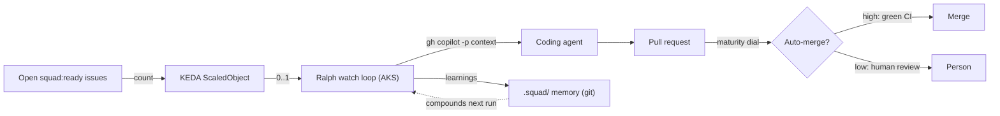

# Coding Squad

> Build it. The Squad picks up the Council's issues, writes the software, and
> opens pull requests, backed by a knowledge base that grows as it works.

## Why this phase

Deciding what to build is only half the job. Something has to build it. The
Coding Squad is that half. It takes the issues the Council filed and turns them
into working code and pull requests, without a person assigning the work by
hand. It also remembers: as it ships, it writes down what it learned, so the
next issue starts from more context than the last one.

DSF does not implement the Squad itself. It uses
[`bradygaster/squad`](https://github.com/bradygaster/squad), an existing
coding-squad product, and wires it into the product's repo. The factory's job
here is integration and handoff, not building another coding agent.

## Responsibilities

- Watch the product repo for issues that carry the handoff label.
- Triage each one and dispatch the Copilot coding agent to implement it.
- Open a pull request with the change.
- Persist what the work taught it into the `.squad/` knowledge base, so future
  triage is better grounded.

The Squad lives in the product repo, next to the code it changes. Its state
(`.squad/`) is part of that repo, which keeps the coding context and the code in
the same place.

## Inputs and outputs

**In:** GitHub issues carrying `squad:ready`. Most come from the Feature
Council. Incident issues from the SRE Agent carry the same label and enter the
same way.

**Out:** pull requests against the product repo. From there the normal review
and merge path takes over and the change deploys.

## Handoffs

Upstream, the Squad takes from two sources, both through the same label: the
Feature Council (new work) and the SRE Agent (fix-forward incidents). It does
not care which one filed the issue. The label is the whole contract.

Downstream, the Squad produces pull requests. What happens to a PR (review,
merge, deploy) is the boundary where a person can still step in, and it is where
production starts to change, which is what the SRE Agent then watches.

## How it runs

Each product runs Ralph, squad's watch loop (`squad watch --execute`), as a
standing Deployment on its own AKS cluster. A KEDA ScaledObject scales it between
zero and one off the count of open `squad:ready` issues: no work means no pod and
no cost, one ready issue brings the loop up, a drained queue scales it back down.
Ralph polls, builds each member's context, dispatches the coding agent, opens pull
requests, and writes what each member learned back into `.squad/`.

The single `squad:ready` label is still the whole contract (ADR 0007). The maturity
dial decides what happens to a squad pull request: low maturity routes it to a human,
high maturity auto-merges it on green CI. Knowledge iteration is squad's own
`.squad/` memory, which lives in git and compounds per run; the loop runs with a
git-notes state backend so it survives the scale-to-zero pod.

## Where it lives and how autonomous it is today

The Squad is an external product that lives inside the product's own repository,
not in this one. DSF owns the deployment harness (the AKS cluster, the Ralph
Deployment, the KEDA ScaledObject, and the maturity dial) and stamps it when it
provisions the instance; the coding agent and the knowledge loop are the Squad
product's own (ADR 0007, ADR 0012). How far the loop runs unattended is the
maturity dial: low keeps a human on every merge, high lets green pull requests
land on their own.

**See also:** the [loop overview](../../README.md#the-loop), the upstream
[Feature Council](feature-council.md), and the [SRE Agent](sre-agent.md) that
watches what ships.
