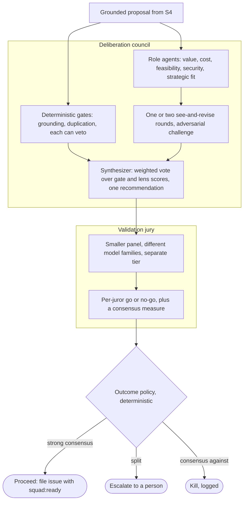

# Feature Council

> Decide what to build. The Council pulls a product's signals on a schedule,
> investigates each one against real evidence, deliberates the survivors through
> a council of role agents, validates the call with a separate model-diverse
> jury, and files the winners as labeled, de-duplicated GitHub issues.

## Why this phase

A product never runs out of things it could do. The hard part is deciding which
of those are worth building, and being able to show why. The Feature Council is
the part of the factory that makes that call. It turns raw signals (an error
spike, a recurring support theme, a competitor move) into a small set of
grounded, argued proposals, and it leaves an audit trail for every accept and
every kill. Because people sit outside the loop, the Council has to defend its
own decisions: every issue it files traces back to evidence, and every proposal
it drops is logged with a reason.

## Responsibilities

The Council runs as a seven-station line (the conveyor). Each station has one
job and hands the run to the next:

- **S1 Triage** drains the signal buffer on a schedule the operator sets,
  normalizes each trigger into a scoped run, and debounces duplicates so the same
  signal cannot start two runs inside the window. Intake is a pull: nothing
  outside the factory sets the council's pace.
- **S2 Investigation** dispatches the product's enabled source agents in
  parallel and collects their structured evidence. A source that is down or
  disabled contributes nothing and says so. Coverage is never invented.
- **S3 Synthesis** clusters the evidence into candidate proposals.
- **S4 Grounding** is a hard gate. It strips any claim that does not trace to a
  real evidence item, and kills any proposal left standing on nothing.
- **S5 Decision** deliberates, then validates. A council of role agents, one per
  decision lens (value, cost, feasibility, security, strategic fit), debates the
  proposal over one or two see-and-revise rounds and synthesizes a single
  recommendation. A separate, model-diverse jury reads that recommendation and
  returns go or no-go by consensus. A deterministic outcome policy turns the
  result into an action: strong consensus proceeds, a split escalates to a
  person, consensus against kills. Every step goes to the log. (Today the proposer
  tier runs deterministic critics with a unilateral veto and a weighted score
  against a threshold, and the model-diverse validation jury, the maturity-gated
  outcome policy, and the escalate-to-review outcome are built. The multi-round
  deliberation council is designed in ADR 0011 and still pending. See below.)
- **S6 Routing** maps each accepted proposal to a product and repo, attaches
  labels from the product's taxonomy, and writes the issue body with a grounded
  evidence appendix.
- **S7 Filing** does a final de-duplication against issues already filed, then
  files (or, in dry-run, records the intent), and consolidates the run into
  lessons for next time.

## The decision subprocess

S5 is where the Council earns its name. A grounded proposal is argued by a
council of role agents, validated by a separate panel, and a fixed policy turns
the result into an action. Two deterministic gates, grounding and duplication,
bracket the debate and can veto on their own; the five role lenses deliberate
over one or two see-and-revise rounds, and a synthesizer folds the gate and lens
scores into one recommendation for the validation jury. (Intake is the one piece
still pending: today a scheduled sweep runs next to a push endpoint, and the
redesign moves to a governed pull. See "Where it lives" below.)

The shape follows the multi-agent research. A council of agents that debate and
revise reaches better-grounded conclusions than a single reasoner (Du et al.
2023), and distinct role personas make debate work for judging, not only for
generating (Chan et al. 2023). The validation tier is kept separate and
model-diverse on purpose: a lone model judge is biased toward its own answers and
to answer position (Zheng et al. 2023), while a panel of smaller, diverse judges
tracks human ratings more closely and flags real disagreement for a person (Verga
et al. 2024). Splitting a propose step from a later synthesize step is the same
layered-aggregation result (Wang et al. 2024).

**Sources:**

- Du et al. 2023, *Improving Factuality and Reasoning in Language Models through Multiagent Debate*, [arXiv:2305.14325](https://arxiv.org/abs/2305.14325).
- Chan et al. 2023, *ChatEval: Towards Better LLM-based Evaluators through Multi-Agent Debate*, [arXiv:2308.07201](https://arxiv.org/abs/2308.07201).
- Wang et al. 2024, *Mixture-of-Agents Enhances Large Language Model Capabilities*, [arXiv:2406.04692](https://arxiv.org/abs/2406.04692).
- Zheng et al. 2023, *Judging LLM-as-a-Judge with MT-Bench and Chatbot Arena*, [arXiv:2306.05685](https://arxiv.org/abs/2306.05685).
- Verga et al. 2024, *Replacing Judges with Juries: Evaluating LLM Generations with a Panel of Diverse Models*, [arXiv:2404.18796](https://arxiv.org/abs/2404.18796).

## Inputs and outputs

**In:** signals scoped to one product. They arrive one way: sources collect into
a buffer and the Council drains it on a schedule it owns, so nothing outside the
factory sets the pace. The webhook endpoint (`/ingest`) only enqueues; the
scheduled worker drains the buffer on each tick. Event-driven urgency stays with
the SRE fast-path (ADR 0011). The sources today are Sentry, Grafana, FoundryIQ,
WebIQ, and tickets.

**Out:** GitHub issues in the product's repo. Each one is labeled by type and
severity, carries the handoff label, and includes the problem, the proposed
change, and the evidence behind it with citations.

## Handoffs

Upstream, the Council consumes signals. Some come from outside the factory
(market and operational telemetry), and over time the SRE Agent feeds production
lessons back in as new signals.

Downstream, the Council hands to the Coding Squad. The contract is one label:
every filed issue carries `squad:ready`, and the Squad's triage keys on exactly
that label. The Council does not call the Squad directly. It files an issue and
the label does the wiring, which keeps the two phases independent.

## Harness and steering

This is the most tunable phase, and most of the factory's dials live here:

- Turn individual critics, source agents, and triggers on or off per product.
- Set each critic's weight in the council vote, and change it while the line
  runs.
- Set the per-product accept threshold.
- Flip the global dry-run switch to run the whole line without filing anything.

Grounding and de-duplication are not optional dials. The grounding gate and the
final dedup always run, so the factory cannot file an ungrounded or repeated
issue regardless of how the other dials are set.

These dials have evolved in place with the deliberation redesign (ADR 0011): the
critic toggles enable or disable lenses, the critic weights set each lens's
influence in the synthesized vote, the accept threshold is the consensus bar, a
per-product deliberation-rounds dial sets how many see-and-revise rounds the
lenses run, and a per-product maturity level sets how much jury consensus is
needed to act without a person and whether the drafted spec auto-merges. All stay
adjustable while the line runs.

## Where it lives and how autonomous it is today

The Feature Council is implemented in this repository, in the `feature-council/`
workspace member. It runs end to end offline in dry-run, and in production as an
Azure Container App scoped to a single product (ADR 0004). It is the most
built-out phase of the loop: the full conveyor, the grounding gate, and the
filing path all run today.

The decision path is the intended shape. The proposer tier is the deliberation
council: five role lenses debate over one or two see-and-revise rounds, grounding
and duplication run as deterministic veto gates, and a synthesizer folds the
scores into one recommendation (Plan 2, landed). A separate model-diverse
validation jury reviews that recommendation under a per-product maturity dial that
accepts, escalates to a human review queue, or kills (Plan 1, landed). Offline the
lenses fall back to their former critics, so the synthesis is the same audited
weighted vote the factory shipped before. Intake is a governed pull: the webhook
endpoint only enqueues and the scheduled worker drains the buffer on the Council's
own cadence (Plan 3, landed). The whole redesign is grounded in the multi-agent
literature and designed in ADR 0011 and its spec. Architecture decisions for this
phase live in ADR 0006 (data adapters), ADR 0007 (the squad handoff), and ADR 0011
(the deliberative redesign).

**See also:** the [loop overview](../../README.md#the-loop), the next phase
[Coding Squad](coding-squad.md), and the decision-path redesign in
[ADR 0011](../adr/0011-feature-council-deliberative-redesign.md) and its
[design spec](../superpowers/specs/2026-06-19-feature-council-deliberative-redesign-design.md).
