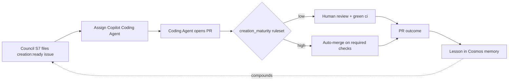

# Creation phase

> Build it. The Creation phase picks up the Council's issues, turns them into
> pull requests through the GitHub Copilot Coding Agent, and feeds what shipped
> back into product memory.

## Why this phase

Deciding what to build is only half the job. Something has to build it. The
Creation phase is that half. It takes grounded issues from the Council and
turns them into code changes without a person standing inside the line.

DSF does not hold a credential that can push code or open pull requests. The
executor is the **GitHub Copilot Coding Agent**, running under GitHub's managed,
ephemeral identity. DSF's job is the contract around it: file the issue, attach
`creation:ready`, assign the agent when the repo supports it, and govern the
merge path with the product's maturity dial.

## Responsibilities

- Receive work through GitHub issues carrying `creation:ready`.
- Assign the GitHub Copilot Coding Agent to ready issues through the DSF GitHub
  App.
- Let the Coding Agent open pull requests under GitHub's managed identity.
- Gate merge through the `dsf-creation` branch-protection ruleset.
- Distill pull request outcomes into product-scoped Lessons in Cosmos memory.

The label is the handoff contract (ADR 0007, renamed by ADR 0019). The executor
and maturity-governed merge path are the current Creation architecture (ADR
0016).

## Inputs and outputs

**In:** GitHub issues carrying `creation:ready`. Most come from the Feature
Council. Incident issues from the SRE Agent carry the same label and enter the
same way.

**Out:** pull requests against the product repo, plus product-scoped Lessons in
Cosmos memory after the PR is approved, rejected, or edited.

## Handoffs

Upstream, the Creation phase takes from two sources, both through the same
label: the Feature Council for planned work and the SRE Agent for fix-forward
incidents. It does not care which one filed the issue. The label is the whole
contract.

Downstream, the Coding Agent produces pull requests. The branch-protection
ruleset decides how far the loop can run unattended: low maturity requires a
human review and green `ci`; high maturity allows auto-merge on required checks.
The feedback watcher then records the result as a Lesson so the next Council run
starts with more product context.

## How it runs

Council station S7 files the routed issue and assigns the GitHub Copilot Coding
Agent through the DSF GitHub App using GitHub GraphQL
`replaceActorsForAssignable`. If Copilot is not enabled on the repo, S7 still
records the issue for de-duplication and leaves an operator note to assign
Copilot manually once enabled.

`dsf new` wires the Creation phase by creating the product repo, seeding baseline
CI, creating the label taxonomy including `creation:ready`, installing the DSF
GitHub App on the repo, and applying the `dsf-creation` branch-protection
ruleset from `creation_maturity`.

The compounding loop is council-side today: `record_outcome` and the PR
`feedback_watcher` distill outcomes into product-scoped Lessons in shared,
namespaced Cosmos memory. Those Lessons are retrieved on the next Council run.

## Where it lives and how autonomous it is today

LANDED: the GitHub Copilot Coding Agent is the executor; S7 files and assigns
ready issues; `creation:ready` is the handoff label; `creation_maturity` drives
the `dsf-creation` ruleset; and the council-side Cosmos lessons and feedback
loop run today.

PENDING: ADR 0016's named coding-member personas — Architect, Implementer,
Test-writer, Security-reviewer, Docs-writer, and Memory-curator — are designed,
not running. The intended grounding path serves Lessons and the product charter
to the Coding Agent through a Cosmos-backed MCP server in the ACA runtime; that
server is designed, not running.

Autonomy is the maturity dial. Low keeps a person on every merge. High lets
required checks carry the merge once the Coding Agent opens the pull request.
The code-writing identity remains GitHub-managed either way.

## See also

- [The loop](the-loop.md)
- [Feature Council](feature-council.md)
- [SRE Agent](sre-agent.md)
