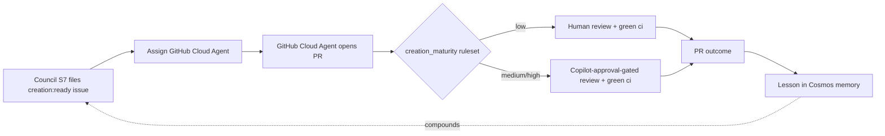

# Creation phase

> Build it. The Creation phase picks up the Council's issues, turns them into
> pull requests, and feeds what shipped back into product memory.

## Why this phase

Deciding what to build is only half the job. Something has to build it. The
Creation phase is that half. It takes grounded issues from the Council and
turns them into code changes without a person standing inside the line.

DSF does not hold a credential that can push code or open pull requests. Code
gets written by whatever implementation the phase is configured with today —
see [Implementation: GitHub Cloud Agent](#implementation-github-cloud-agent)
below. DSF's job is the contract around it: file the issue, attach
`creation:ready`, assign an executor when the repo supports it, and govern the
merge path with the product's maturity setting.

## Responsibilities

- Receive work through GitHub issues carrying `creation:ready`.
- Assign an executor to ready issues through the DSF GitHub App.
- Let the executor open pull requests under its own managed identity.
- Gate merge through the `dsf-creation` branch-protection ruleset.
- Distill pull request outcomes into product-scoped Lessons in Cosmos memory.

The label is the handoff contract (ADR 0007, renamed by ADR 0019) — see
[Handoffs](handoffs.md) for the full mechanism. The executor and
maturity-governed merge path are the current Creation architecture (ADR 0016).

## Inputs and outputs

**In:** GitHub issues carrying `creation:ready`. Most come from the Feature
Council. Incident issues from the Operation phase carry the same label and
enter the same way — see [Handoffs](handoffs.md).

**Out:** pull requests against the product repo, plus product-scoped Lessons in
Cosmos memory after the PR is approved, rejected, or edited.

## Implementation: GitHub Cloud Agent

The Creation phase's executor today is GitHub's managed **GitHub Cloud Agent**,
running under GitHub's managed, ephemeral identity. This is an implementation
detail of the phase, not the phase's name: DSF could point the same contract
(labeled issue in, pull request out, maturity-governed merge) at a different
executor without changing what the Creation phase is.

Council station S7 files the routed issue and assigns the GitHub Cloud Agent
through the DSF GitHub App using GitHub GraphQL `replaceActorsForAssignable`.
If the GitHub Cloud Agent is not enabled on the repo, S7 still records the
issue for de-duplication and leaves an operator note to assign it manually
once enabled.

`dsf new` wires the Creation phase by creating the product repo, seeding
baseline CI, creating the label taxonomy including `creation:ready`, installing
the DSF GitHub App on the repo, and applying the `dsf-creation`
branch-protection ruleset from `creation_maturity`.

```mermaid
flowchart LR
    FC["Council S7 files creation:ready issue"] --> A["Assign GitHub Cloud Agent"]
    A --> PR["GitHub Cloud Agent opens PR"]
    PR --> G{"creation_maturity ruleset"}
    G -->|low| H["Human review + green ci"]
    G -->|medium/high| C["Copilot-approval-gated review + green ci"]
    H --> O["PR outcome"]
    C --> O
    O --> L["Lesson in Cosmos memory"]
    L -.->|compounds| FC
```

The compounding loop is council-side today: `record_outcome` and the PR
`feedback_watcher` distill outcomes into product-scoped Lessons in shared,
namespaced Cosmos memory. Those Lessons are retrieved on the next Council run.

## Where it lives and how autonomous it is today

LANDED: the GitHub Cloud Agent is the executor; S7 files and assigns ready
issues; `creation:ready` is the handoff label; `creation_maturity` drives the
`dsf-creation` ruleset (including, at medium/high, a Copilot-approval gate in
place of a standing human reviewer); and the council-side Cosmos lessons and
feedback loop run today.

PENDING: ADR 0016's named coding-member personas — Architect, Implementer,
Test-writer, Security-reviewer, Docs-writer, and Memory-curator — are designed,
not running. The intended grounding path serves Lessons and the product
charter to the executor through a Cosmos-backed MCP server in the ACA runtime;
that server is designed, not running.

Autonomy is the `creation_maturity` setting. Low keeps a person on every merge.
Medium and high let a Copilot approval satisfy the required-review gate, and
high additionally adds an automated retry workflow. The code-writing identity
remains GitHub-managed at every level.

## See also

- [The loop](the-loop.md)
- [Handoffs](handoffs.md)
- [Feature Council](feature-council.md)
- [Operation phase](sre-agent.md)
