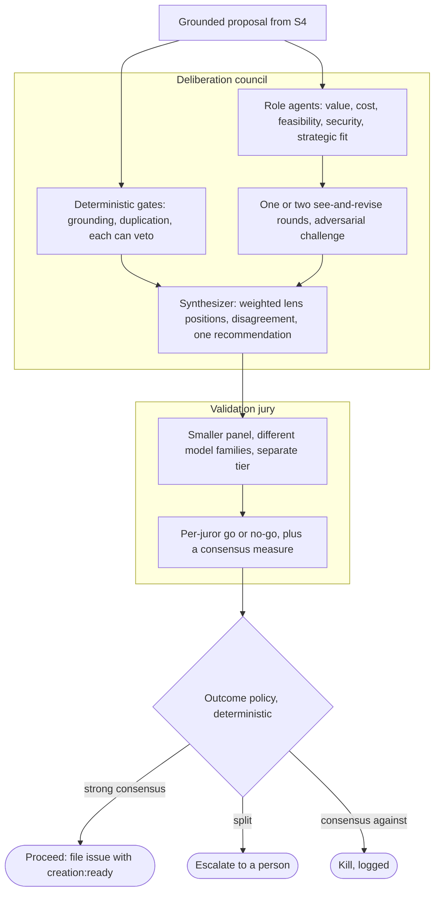

# Feature Council

> Decide what to build. The Council pulls a product's signals on a schedule,
> investigates each one against real evidence, deliberates the survivors through
> a council of role agents, validates the call with a separate model-diverse
> jury, and files the winners as labeled, de-duplicated GitHub issues.

## Why this phase

A product never runs out of things it could do. The hard part is deciding which
of those are worth building, and being able to show why. The Feature Council is
the part of the factory that makes that call. It turns raw signals (an error
spike, a recurring support theme, a competitor move) into a small set of
grounded, argued proposals, and it leaves an audit trail for every accept and
every kill. Because people sit outside the loop, the Council has to defend its
own decisions: every issue it files traces back to evidence, and every proposal
it drops is logged with a reason.

## Responsibilities

The Council runs as a seven-station line (the conveyor). Each station has one
job and hands the run to the next:

- **S1 Triage** normalizes a sweep into a scoped run and debounces duplicates.
  The orchestrator's in-process loop owns scheduled intake; there is no inbound
  signal queue in the .NET runtime.
- **S2 Investigation** dispatches the product's enabled source agents in
  parallel and collects their structured evidence. A source that is down or
  disabled contributes nothing and says so. Coverage is never invented.
- **S3 Synthesis** clusters related evidence across source kinds into candidate
  proposals, retaining contributing evidence references and source kinds.
  It does not decide whether a proposal is worth building.
- **S4 Grounding** is a hard gate. It strips any claim that does not trace to a
  real evidence item, and kills any proposal left standing on nothing.
- **S5 Decision** deliberates, then validates. A council of role agents, one per
  decision lens (value, cost, feasibility, security, strategic fit), debates the
  proposal over one or two see-and-revise rounds and synthesizes a single
  recommendation. A separate, model-diverse jury reads that recommendation and
  returns go or no-go by consensus. A deterministic outcome policy turns the
  result into an action: strong consensus proceeds, a split escalates to a
  person, consensus against kills. Low creation maturity always requires human
  review. Malformed, missing, or failed juror results are errors, not approval.
  Every step goes to the log.
- **S6 Routing** maps each accepted proposal to a product and repo, attaches
  labels from the product's taxonomy, and writes the issue body with a grounded
  evidence appendix.
- **S7 Filing** does a final de-duplication against issues already filed, then
  files (or, in dry-run, records the intent), and consolidates the run into
  lessons for next time.

## The decision subprocess

S5 is where the Council earns its name. A grounded proposal is argued by a
council of role agents, validated by a separate panel, and a fixed policy turns
the result into an action. Two deterministic gates, grounding and duplication,
bracket the debate and can veto on their own; the five role lenses deliberate
over one or two see-and-revise rounds, and a deterministic synthesizer folds the
lens positions into one recommendation for the separate validation jury.

The shape follows the multi-agent research. A council of agents that debate and
revise reaches better-grounded conclusions than a single reasoner (Du et al.
2023), and distinct role personas make debate work for judging, not only for
generating (Chan et al. 2023). The validation tier is kept separate and
model-diverse on purpose: a lone model judge is biased toward its own answers and
to answer position (Zheng et al. 2023), while a panel of smaller, diverse judges
tracks human ratings more closely and flags real disagreement for a person (Verga
et al. 2024). Splitting a propose step from a later synthesize step is the same
layered-aggregation result (Wang et al. 2024).

**Sources:**

- Du et al. 2023, *Improving Factuality and Reasoning in Language Models through Multiagent Debate*, [arXiv:2305.14325](https://arxiv.org/abs/2305.14325).
- Chan et al. 2023, *ChatEval: Towards Better LLM-based Evaluators through Multi-Agent Debate*, [arXiv:2308.07201](https://arxiv.org/abs/2308.07201).
- Wang et al. 2024, *Mixture-of-Agents Enhances Large Language Model Capabilities*, [arXiv:2406.04692](https://arxiv.org/abs/2406.04692).
- Zheng et al. 2023, *Judging LLM-as-a-Judge with MT-Bench and Chatbot Arena*, [arXiv:2306.05685](https://arxiv.org/abs/2306.05685).
- Verga et al. 2024, *Replacing Judges with Juries: Evaluating LLM Generations with a Panel of Diverse Models*, [arXiv:2404.18796](https://arxiv.org/abs/2404.18796).

## Inputs and outputs

**In:** evidence scoped to one product, gathered over A2A `/gather` from enabled
served source agents. The Microsoft-native roster is `azuremonitor`, `foundryiq`,
and `webiq`; unconfigured kinds remain disabled and receive no Container App.
The .NET runtime has neither an in-process S2 fallback nor an `/ingest` queue.
Event-driven urgency stays with the Operation phase.

**Out:** GitHub issues in the product's repo. Each one is labeled by type and
severity, carries the handoff label, and includes the problem, the proposed
change, and the evidence behind it with citations.

## Handoffs

Upstream, the Council consumes signals. Some come from outside the factory
(market and operational telemetry), and over time the Operation phase feeds production
lessons back in as new signals.

Downstream, the Council hands to the Creation phase. The contract is one label:
every filed issue carries `creation:ready`, and the GitHub Cloud Agent picks up issues carrying exactly
that label. The Council does not call the executor directly. It files an issue and
the label does the wiring, which keeps the two phases independent. See
[Handoffs](handoffs.md) for the full mechanism.

## Harness and steering

This is the most tunable phase, and most of the factory's dials live here:

- Pause/resume sweeps and adjust cadence through product App Configuration.
- Enable provisioned source agents through `agents.<kind>.enabled`.
- Set the per-product synthesis threshold.
- Configure lens enablement/weights, rounds, and the separate jury roster at
  deployment with `dsf new --decide-config`.
- Use `--dry-run` to run the line without filing anything.

Grounding and de-duplication are not optional dials. The grounding gate and the
final dedup always run, so the factory cannot file an ungrounded or repeated
issue regardless of how the other dials are set.

Sweep controls and source flags are read from App Configuration. Lens/jury
configuration and creation maturity are runtime environment settings, so changing
the deployed values requires a revision update. The synthesis threshold is not
a shortcut around the jury: only a valid unanimous-go result can proceed at
medium/high maturity, and low maturity always escalates.
Routing and filing reapply the current maturity even when S5 or S6 was already
checkpointed. Lowering maturity to low therefore escalates an earlier approval
instead of allowing it to auto-file.

## Where it lives and how autonomous it is today

The Feature Council is implemented in this repository under
`dotnet/src/Dsf.FeatureCouncil/` and hosted by `dotnet/src/Dsf.Runtime/`. It runs
end to end in dry-run through the real .NET runtime composition, and in
production as Azure Container Apps scoped to a single product (ADR 0004). It is
the most built-out phase of the loop: the full conveyor, the grounding gate, and
the filing path all run today.

S3 uses cross-source-capable lexical similarity clustering. S5 records typed lens
positions, deterministic synthesis, juror results, and an explicit
`Proceed` / `Escalate` / `Kill` / `Error` verdict. S6/S7 consume that verdict;
an escalated run retains its review package and cannot auto-file. Production
has no offline model fallback.
Persisted votes and recommendation fields must be explicit: an incomplete
review becomes an audited error, never an implicit go vote.

S3 resolves each cluster against persisted problem profiles using the same
lexical clustering policy. The resulting opaque problem ID, within the run's
scope namespace, identifies both filing intents and human lessons. References
and changing observation text are evidence, not the ID. Ambiguous matches to
multiple known problems fail for human consolidation rather than silently
merging their histories. Newly recognized observations extend the persisted
profile under the same ID, so subsequent runs can recognize them too.

The always-on orchestrator runs `serve-orchestrator --loop`, reads sweep controls
from App Configuration, and acquires a Cosmos lease before driving the line.
The `runs` and `learning` containers use the `/product` partition key; existing
legacy `/id` containers are retained separately.

Offline integration tests exercise HTTP hosting and station control flow with
scripted external boundaries. They are not evidence that a vendor API works,
that three different model families judged a real proposal, or that production
filed an issue. [Issue #183](https://github.com/JoranBergfeld/dark-software-factory/issues/183)
requires a separate live/staging manual sweep, an observed autonomous tick, and
the resulting GitHub issue. See [Operate it](../get-started/operate.md).

**See also:** the [loop overview](the-loop.md), the next phase
[Creation phase](creation.md), and the decision-path redesign in
[ADR 0011](https://github.com/JoranBergfeld/dark-software-factory/blob/main/docs/adr/0011-feature-council-deliberative-redesign.md)
and its
[design spec](https://github.com/JoranBergfeld/dark-software-factory/blob/main/docs/superpowers/specs/2026-06-19-feature-council-deliberative-redesign-design.md).
