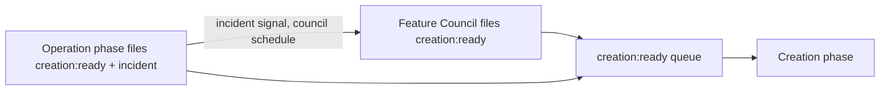

# Handoffs

> The label is the contract. Creation and Operation trade work through GitHub
> issue labels alone — neither phase needs to know which implementation is on
> the other end.

## Why a separate page

The Creation phase and the Operation phase are each defined by what they do,
not by the product that implements them today. What connects them — the
labels, the assignment mechanics, and the incident-to-PR path — is its own
concern, and it should not be buried inside either phase's own page.

## The label-based handoff

Two labels carry all handoff intent:

- **`creation:ready`** — an issue is ready for the Creation phase to build.
  The Feature Council files it for planned work; the Operation phase files it
  for fix-forward incidents. The Creation phase does not care which one filed
  it — the label is the whole contract (ADR 0007, renamed by ADR 0019).
- **`incident`** — stamped by the Operation phase on incident issues, in
  addition to `creation:ready`, so the Feature Council's `incidents` and
  `azuremonitor` sources can pull them back in as signal on the council's
  own schedule (ADR 0013), separately from the fast fix-forward path.

## Assignment: manual vs. automated by maturity

Filing a `creation:ready` issue does not by itself put an executor to work on
it — an issue still needs to be *assigned*. Whether that assignment happens
automatically depends on maturity, not on which phase filed the issue:

- At **low** creation maturity, issues are filed and labeled but assignment to
  the GitHub Cloud Agent is a manual operator step (or left to whatever
  repo-level automation the operator has configured).
- At **medium/high** creation maturity — or when the runtime's
  `DSF_ASSIGN_CLOUD_AGENT` setting is enabled — the filer automatically
  assigns the GitHub Cloud Agent to the issue through GitHub GraphQL
  `suggestedActors`/`replaceActorsForAssignable`, the same mechanism behind
  GitHub's own "Assign to Copilot" UI action. If the GitHub Cloud Agent is not
  enabled on the repo, or the assignment call fails for any reason,
  assignment is skipped without failing the filing — the issue is still filed
  and labeled, and a human can assign it manually.

Automated assignment is best-effort by design: a filed-but-unassigned issue is
never a failure state, only a state that still needs a human's attention.

## The incident-to-PR path

An incident travels a fixed path from production back to a merged fix:

1. The Operation phase's implementation (see
   [Operation phase](sre-agent.md)) detects and investigates an incident
   against production telemetry.
2. It files (or updates) a GitHub issue carrying `creation:ready` and
   `incident`.
3. Assignment happens per the maturity rule above.
4. The Creation phase's implementation (see
   [Creation phase](creation.md)) opens a pull request against the fix.
5. The `dsf-creation` branch-protection ruleset governs the merge, per
   `creation_maturity`.
6. The PR outcome is distilled into a product-scoped Lesson in Cosmos memory,
   and the `incident` label lets the same event also reach the Feature
   Council as signal on its own schedule.

## See also

- [The loop](the-loop.md)
- [Creation phase](creation.md)
- [Operation phase](sre-agent.md)
- [Feature Council](feature-council.md)
