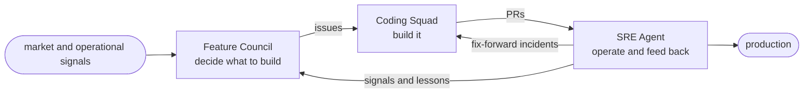

# The loop

DSF runs as a loop of three phases. Each one has a single job, hands off to the next, and
what happens in production comes back to the start.

## Feature Council: decide what to build

It watches operational and market signals and digs into each one against real evidence. It
puts the proposals in front of a council of critics that argue them down, and the ones that
survive get filed as labeled, de-duplicated GitHub issues. The job is to work out what's
worth building.

→ [Feature Council](feature-council.md)

## Coding Squad: build it

It takes the Council's issues, writes the software, and opens pull requests. A coding agent
does the work, backed by a knowledge base that grows as it goes.

→ [Coding Squad](coding-squad.md)

## SRE Agent: operate and feed back

It watches production, sends incidents straight back to the Squad as fixes, and passes what
it learns to the Council as new signals and lessons. It keeps the product running and teaches
the factory how that product actually behaves.

→ [SRE Agent](sre-agent.md)

## One factory per product

Every product gets its own copy of this loop, fully isolated. No signals, memory, or context
cross between products, so each factory's reasoning stays scoped and easy to audit. One
command stamps out a complete, isolated factory for a product — see
[Provision a factory](../get-started/provision-a-factory.md).
