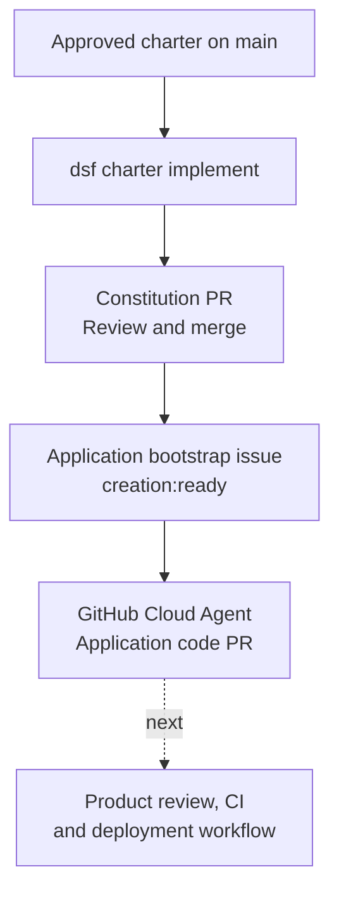

# Implement the application

**The factory is provisioned; the application still needs to be built.**
`dsf charter implement` starts that work. It does not instantly provision or deploy
a finished application.

## 1. Define the application

After [`dsf new`](provision-a-factory.md), open a charter PR:

```bash
dsf charter init --product <product>
```

Review and merge `.dsf/charter.md` into `main`. It defines the application's purpose,
users, goals, constraints, and success metrics.

## 2. Start implementation

```bash
dsf charter implement --product <product>
```



The command reads the merged charter, proposes the constitution, and waits for that
PR to merge before filing the build issue. It attempts to assign the GitHub Cloud
Agent, then watches the build PR. If assignment fails, assign the issue manually.

`--no-wait` skips watching the build; it does **not** skip constitution approval.

**Application code, application-specific infrastructure, and deployment are outcomes
of the product's implementation and release work—not of `dsf bootstrap` or `dsf new`.**

Next: [operate the factory](operate.md).
