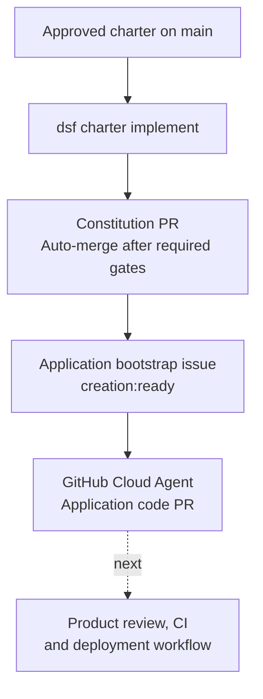

# Implement the application

**The factory is provisioned; the application still needs to be built.**
`dsf charter implement` starts that work. It does not instantly provision or deploy
a finished application.

## 1. Define the application

After [`dsf new`](provision-a-factory.md), open a charter PR:

```bash
dsf charter init --product <product>
```

The interview defines the application's purpose, users, goals, constraints, and
success metrics in `.dsf/charter.md`. The CLI requests auto-merge: required CI and
any required approvals must pass, but no separate merge click is needed.
Wait for the charter to reach `main` before implementing.

## 2. Start implementation

Keep `DSF_OWNER_APPCONFIG_ENDPOINT` set to the owner store created by bootstrap.
The CLI discovers this product's Cosmos endpoint and database from the index
published by `dsf new`; no `AZURE_COSMOS_ENDPOINT` export is needed.

```bash
dsf charter implement --product <product>
```



The command reads the merged charter, proposes the constitution, requests auto-merge,
and waits for that PR to merge before filing the build issue. It attempts to assign the GitHub Cloud
Agent, then watches the build PR. If assignment fails, assign the issue manually.

`--no-wait` skips watching the build; it does **not** skip constitution approval.

Both setup commands enable repository auto-merge if needed; this requires repository
administration permission. They use `gh pr merge --auto --squash`, so keep `gh`
installed and authenticated. Branch protections are unchanged: low creation maturity
still requires human approval where provisioned. Auto-merge failures report the PR
URL and stop; rerun the same command to reuse the open PR and retry.

## 3. Replace scaffold CI

The build issue instructs the agent to replace `.github/workflows/ci.yml` with real
build/type-check, tests, lint/format checks, and static analysis for its chosen stack.
These run automatically on pull requests and pushes to `main`. The required `ci`
check must fail if any required job fails, is cancelled, or unexpectedly skips.
Verify the implementation PR includes these workflows; a green scaffold check alone
does not prove application quality.

**Application code, application-specific infrastructure, and deployment are outcomes
of the product's implementation and release work—not of `dsf bootstrap` or `dsf new`.**

Next: [operate the factory](operate.md).
