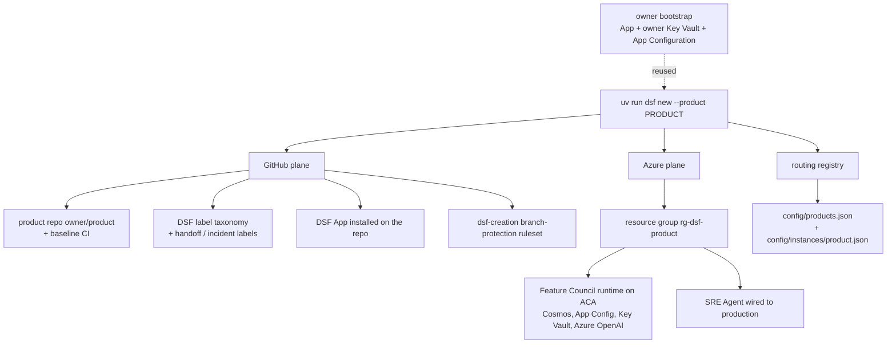
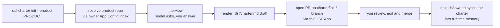

# Provision a factory

!!! warning "Bootstrap the owner first (one-time)"
    `dsf new` reuses the master DSF GitHub App and the owner Key Vault / App Configuration
    created by [`dsf bootstrap`](quickstart.md#bootstrap-the-owner-one-time). Run that once
    per owner and export `DSF_OWNER_KEYVAULT_URI` + `DSF_OWNER_APPCONFIG_ENDPOINT` before
    provisioning any product — without them `dsf new` cannot install the App or resolve the
    owner product index.

The factory CLI is `dsf`. Provisioning a product needs only `--product`:

```bash
uv run dsf new --product <product>
```

Two inputs are inferred so you don't have to pass them:

- **`--owner`** defaults to your gh-authenticated account (resolved via `gh api user`). When
  omitted, DSF prints a warning naming the account; in an interactive terminal it also asks
  you to confirm before creating the repo there. Pass `--owner <org>` to target an
  organization instead.
- **`--name-prefix`** (the base for Azure resource names) defaults to your `--product` key,
  sanitized and randomized to a 12-character, Azure-safe prefix.

**Preview before you commit.** `dsf new` executes for real by default; `--dry-run` prints the
what-if plan and provisions nothing:

```bash
uv run dsf new --product <product> --dry-run                # preview only
uv run dsf new --product <product> --dry-run --write-plan   # preview + persist the manifest
```

The fuller form, pinning everything explicitly:

```bash
uv run dsf new \
  --product microbi \
  --owner my-org \
  --name-prefix microbi \
  --visibility private \
  --location swedencentral \
  --creation-maturity low   # 'low' routes every PR to a human; 'high' auto-merges on green CI
```

Run `uv run dsf new --help` for the full flag list.

!!! note "Live progress during the Azure step"
    The `provision_azure` step runs `az deployment group create --no-wait` and polls the
    deployment, streaming each Azure resource as it starts and finishes (indented
    `· <type> <name>: <state>` lines) so a multi-minute deployment is never silent. On
    failure the specific failed resource and its reason are surfaced. Tune the poll cadence
    with `DSF_DEPLOY_POLL_INTERVAL` (seconds, default 5).

    The poll is **bounded** by `DSF_DEPLOY_TIMEOUT` (seconds, default 600 = 10 min; set
    `<= 0` to wait indefinitely). If the deployment is still running at the bound, `dsf new`
    cancels it and fails the step naming the still-running resource(s) — rather than hanging.
    The WebIQ source agent uses the Microsoft **WebIQ SDK** (API-key auth). After the
    Azure deployment, the `seed_webiq_key` step copies the `webiq-api-key` secret from the
    owner Key Vault into the product Key Vault (mirroring the GitHub App key seed); the agent
    reads it at runtime via the Container App managed identity. Pre-seed `webiq-api-key` in
    the owner vault before `dsf new` (see Prerequisites). The seed carries a 30-day expiry
    (a Key Vault policy requirement), so it is re-seeded on every `dsf new`.

## Prerequisites

Provisioning spans three planes — GitHub, Azure resources, and Azure RBAC — so the principal
running `dsf new` needs:

- **The owner bootstrap has run:** [`dsf bootstrap`](quickstart.md#bootstrap-the-owner-one-time)
  has created the master DSF GitHub App, the owner Key Vault, and the owner App Configuration,
  and `DSF_OWNER_KEYVAULT_URI` / `DSF_OWNER_APPCONFIG_ENDPOINT` are exported in this shell.
- **GitHub:** a `gh auth login` session that can create repos under `--owner` and seed the
  baseline CI workflow.
- **Azure subscription RBAC:** **Owner**, or **Contributor + User Access Administrator**, on
  the subscription — the cross-resource-group role assignments (runtime identity, SRE Agent)
  require it.
- **Key Vault reachability for the one-time secret seed:** the GitHub App key and the
  WebIQ API key are written to the product Key Vault via `az keyvault secret set` as the
  operator, so the principal is granted **Key Vault Secrets Officer** on the vault. Because
  the vault defaults to network-`Deny` (`allowPublicNetworkAccess=false`), run provisioning
  from a host that can reach the vault data plane — deploy with
  `allowPublicNetworkAccess=true` for a dev instance, or provision from inside the vault's
  network.
- **Owner vault secrets:** the owner Key Vault must contain `github-app-private-key` (the
  GitHub App's private key) and `webiq-api-key` (the WebIQ SDK API key) before `dsf new`.
  Both must be set with `--content-type text/plain` and a `--expires` date ≤30 days out to
  satisfy the tenant's Key Vault secret policy (re-seed on rotation/expiry).

## What gets provisioned

A complete, isolated factory for the product:

- a GitHub repo (`<owner>/<product>`) with baseline CI, the DSF label taxonomy, the DSF
  GitHub App, and the `dsf-creation` branch-protection ruleset,
- a dedicated Azure resource group (`rg-dsf-<product>`) with the runtime deployed from
  `infra/main.bicep`,
- the product registered in the routing registry (`config/products.json`),
- an **SRE Agent** wired to its production.



The persisted manifest lives under `config/instances/<product>.json`; re-running `dsf new`
for the same product is idempotent (it reuses the persisted name prefix).

## Seed its intent (the charter)

A freshly provisioned factory is **inert**: until a [product charter](operate.md#the-product-charter)
(`.dsf/charter.md`) lands on `main`, the Feature Council has nothing to ground proposals
against and tags every run `uncharted product context`. So `dsf new` doesn't stop at the
infrastructure — on a successful run against a greenfield factory it guides you straight into
seeding intent:

- In an **interactive terminal** it offers to chain into the charter interview:

    ```text
    [dsf] Your factory has no intent yet. Seed its charter now? [Y/n]
    ```

    Answer `Y` and it runs `dsf charter init --product <product>` for you (the interview, then
    a charter PR). Answer `n` and it prints the copy-pasteable next step instead.
- It only prompts for **greenfield** factories — if `.dsf/charter.md` is already on `main` or a
  `charter/*` PR is already open, it says so and doesn't nag.
- It **never blocks** automation: when stdin isn't a TTY, or you pass `--no-charter`, it skips
  the prompt and just prints the next step. Charter seeding is layered on top of provisioning,
  so a failure in the interview never fails `dsf new` itself.

Opening the PR is not the finish line. The charter only becomes authoritative once you
**review and merge** it, after which the next `dsf sweep` syncs it into the runtime. The
full path to a *charted* factory is:

```text
dsf new  →  charter PR  →  review & merge  →  dsf sweep
```

See [Operate it › The product charter](operate.md#the-product-charter) for the charter
commands in full.

The interview-to-merge path for `dsf charter init` is:



Once a factory exists, move on to [Operate it](operate.md).
