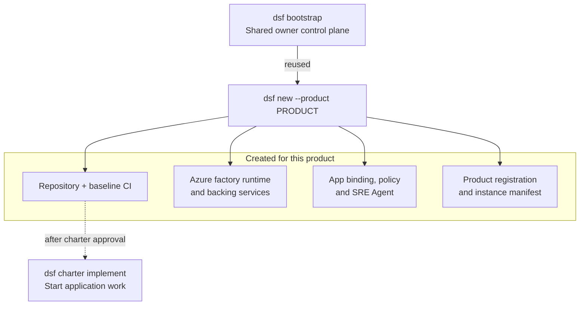

# Provision a factory

!!! warning "Bootstrap the owner first"
    Run `dsf bootstrap` before a live `dsf new`, then export the printed
    `DSF_OWNER_KEYVAULT_URI` and `DSF_OWNER_APPCONFIG_ENDPOINT`.

!!! info "This provisions the factory, not the application"
    `dsf new` creates the product repository and the services that run its factory.
    It does not implement application features, provision application-specific
    infrastructure, or deploy a working application. That work starts with
    [`dsf charter implement`](implement-application.md), after charter approval.

The factory CLI is `dsf`. Provisioning a product needs only `--product`:

```bash
dsf new --product <product>
```

Provisioning templates are bundled as compiled ARM JSON, including topology, SRE Agent,
and cross-vault secret-copy dependencies. Run from any directory without a clone or Bicep.
DSF validates these assets and Azure CLI availability before creating repositories or Azure
resources. `--config-root` changes only instance-state storage; it does not select templates.
For missing/corrupt assets, reinstall the package or re-extract the complete verified archive.

Two inputs are inferred when omitted:

- `--owner` defaults to your `gh`-authenticated account. Pass `--owner <org>` for an organization.
- `--name-prefix` defaults to the product key, sanitized and randomized to an Azure-safe prefix.

Preview before provisioning:

```bash
dsf new --product <product> --dry-run
dsf new --product <product> --dry-run --write-plan
```

Dry-run uses the same owner endpoints as live provisioning: explicit
`--owner-keyvault-uri` / `--owner-appconfig-endpoint` options take precedence over
`DSF_OWNER_KEYVAULT_URI` / `DSF_OWNER_APPCONFIG_ENDPOINT`. `--write-plan` saves these
nonsecret endpoints in the instance manifest.

Dry-run does not read owner credentials. With an owner Key Vault configured but no
explicit App/installation IDs, App binding is shown as **pending owner credential
resolution**, not skipped. Private-key copying and product-index publication are
planned independently from their configured endpoints. WebIQ key seeding remains
a manual prerequisite, not an automatic provisioning step.

Full explicit form:

```bash
dsf new \
  --product microbi \
  --owner my-org \
  --name-prefix microbi \
  --visibility private \
  --location swedencentral \
  --creation-maturity low
```

Run `dsf new --help` for the full flag list.

For an immutable runtime image, first generate the instance manifest with
`--dry-run --write-plan`, set its `runtime.image` to a published commit tag or
digest, then run the same command without the dry-run flags. Repeated `dsf new`
invocations preserve that image, and the preview reports the selected image.

## Private backing-service connectivity

Inherited Azure Policy can disable Key Vault or Cosmos public access even when a
deployment requests public access. Do not relax that policy: connect the runtime
through private endpoints and private DNS instead.

Set `azure.infrastructureSubnetId` in the saved instance manifest to the full ID
of a subnet delegated to `Microsoft.App/environments`. Repeated `dsf new` calls
preserve it and select a separate VNet-integrated, Consumption-profile Container
Apps environment. Omit this field to retain the default environment; an empty or
malformed value is rejected. Private endpoints and DNS must be reachable on the
chosen VNet before expecting healthy runtime data-plane access.

For existing backing services, including a partially completed new factory,
`infra/instance-private-network.bicep` creates an isolated VNet, delegated app
subnet, and private endpoints/DNS for that resource group's Key Vault and Cosmos:

```bash
az deployment group create \
  --resource-group rg-dsf-<product> --name dsf-private-network \
  --template-file infra/instance-private-network.bicep \
  --parameters namePrefix=<effective-prefix> \
    keyVaultName=<existing-vault> cosmosAccountName=<existing-cosmos> \
  --query properties.outputs.infrastructureSubnetId.value --output tsv
```

Use the manifest's effective `azure.namePrefix`, not the unnormalized command-line
base prefix. Save the returned subnet ID in `azure.infrastructureSubnetId`, then
rerun provisioning. The default ranges are `10.173.0.0/16`, `10.173.0.0/23`
(apps), and `10.173.2.0/24` (endpoints); override the three address-prefix
parameters before deployment when peering requires different, nonoverlapping
ranges. This template does not change either service's public-access policy.
External private Search/model services need their own authorized connectivity.

!!! warning "Existing apps cannot move environments in place"
    Switching between default and VNet-integrated environments is not an automatic
    migration. Pause the factory, retain its desired configuration, and recreate
    only its Container Apps in the new environment. Do not delete backing services
    or another factory's resources. Remove the superseded environment only after
    the replacement apps resolve private DNS and authenticate to the real services.

## Enable Decide sources and judgment

Source agents default to disabled. Supply `--decide-config <path>` to provision
only the selected Microsoft-native agents, seed their product-scoped
`agents.<kind>.enabled` flags, and wire the orchestrator's internal A2A endpoints.
The nonsecret configuration is retained under `runtime.decide` in the instance
definition and reused when a subsequent `dsf new` omits this option.

Example `decide.json` (replace endpoints and deployment names with existing,
authorized Azure model deployments):

```json
{
  "enabledSourceAgentKinds": ["webiq"],
  "webIqQuery": "checkout reliability problems and customer needs",
  "juryModels": [
    {"name":"value-check","provider":"openai","family":"gpt","endpoint":"https://models.example","deployment":"gpt-4o"},
    {"name":"challenge","provider":"deepseek","family":"deepseek","endpoint":"https://models.example","deployment":"DeepSeek-V3"},
    {"name":"independent-check","provider":"xai","family":"grok","endpoint":"https://models.example","deployment":"grok-4"}
  ],
  "juryTimeoutSeconds": 120,
  "deliberationRounds": 2,
  "lenses": [{"name":"cost","enabled":true,"weight":0.5}]
}
```

```bash
dsf new --product microbi --creation-maturity medium \
  --decide-config decide.json --dry-run --write-plan
```

Enabling any source requires three distinct juror families and deployment targets.
The supported Azure-hosted provider/family pairs are `openai/gpt`,
`deepseek/deepseek`, and `xai/grok`; three aliases for the same model are rejected
at configuration or response validation. The runtime uses Azure managed identity
against `/openai/v1/chat/completions`. This template does **not** create those
three external deployments or grant access on external accounts automatically.
Grant the runtime identity the appropriate model data-plane role on each account.
The synthesis/lens model remains the product's configured Azure OpenAI deployment.

All five lenses default to enabled with weight 1. `lenses` can override `value`,
`cost`, `feasibility`, `security`, or `strategic-fit`; at least one must remain
enabled. Rounds must be 1 or 2, weights finite and positive, and juror timeouts
1–600 seconds. Low creation maturity always escalates; medium/high permits
filing only for a valid unanimous-go jury outcome.

| Source | Required configuration | External prerequisite |
|---|---|---|
| `azuremonitor` | `azureMonitorWorkspaceId`, `azureMonitorQuery` (KQL) | Runtime identity authorized to query that Log Analytics workspace |
| `foundryiq` | `foundryIqSearchEndpoint`, `foundryIqKnowledgeBase`, `foundryIqQuery` | Azure AI Search knowledge base; Search Index Data Reader for the runtime identity |
| `webiq` | `webIqQuery` | `webiq-api-key` already present in the product Key Vault |

Azure Monitor queries must return exactly one table with nonempty string
`Reference` and `Summary` columns. For example, a Container Apps log query can
project `Reference=strcat("azuremonitor://<workspace-id>/", ContainerAppName_s, "/", ContainerGroupName_s, "/", tostring(TimeGenerated))`
and `Summary=Log_s`, replacing `<workspace-id>` with the actual workspace ID.
Choose references that identify the actual source record; `_ResourceId` can be
empty in Container Apps custom logs. Use Kusto's `tostring` for timestamps, not
the .NET-only `format_datetime(..., "o")` format.
Partial or truncated query results fail rather than silently losing evidence.
For a local proof, `AZURE_TOKEN_CREDENTIALS=AzureCliCredential` selects the
existing `az login` identity without waiting for unavailable hosted credentials;
deployed apps continue to use managed identity.

FoundryIQ uses the **Search service root**, not a Foundry project endpoint.
WebIQ uses Microsoft's SDK-compatible `/v3/search/web` API. Do not put API keys,
tokens, or passwords in this file; unknown properties are rejected. Secret
seeding remains an operator prerequisite, not an implemented `dsf new` step.
For local WebIQ development only, `WEBIQ_API_KEY` overrides Key Vault resolution.

!!! note "Live provisioning progress"
    `dsf new` reports preparation immediately, then names each owner-identity lookup,
    GitHub operation, Azure deployment, configuration write, and manifest save before
    it starts. Long operations print `Still waiting: <operation>` every 10 seconds,
    with elapsed time. `Completed` means the operation returned successfully;
    `Stopped` is followed by the command's error or cancellation outcome.

    These are stage-level waiting notices, not Azure resource-level progress or
    completion percentages. Tokens, private keys, and raw subprocess output are not
    included in progress messages.

    A rebuilt CLI only changes subsequent runs. Do not start a second provisioning
    command alongside an existing one. Ctrl+C cancels the local invocation, but an
    Azure deployment already submitted may continue server-side; check its state
    before retrying with the same product and resource names.

## Prerequisites

Provisioning spans GitHub, Azure resources, and Azure RBAC. The principal running `dsf new`
needs:

- **Owner configuration:** `DSF_OWNER_KEYVAULT_URI` and `DSF_OWNER_APPCONFIG_ENDPOINT`
  identify the control plane created by `dsf bootstrap`; the App Configuration endpoint (or
  `--owner-appconfig-endpoint`) is required for a live run to publish the product index.
- **GitHub:** `GH_TOKEN` or `GITHUB_TOKEN` that can create repositories under `--owner` and seed
  baseline CI. The CLI does not retrieve credentials from App Configuration. When owner Key
  Vault is configured, the CLI resolves stored GitHub App and installation identifiers
  automatically. Explicit identifiers remain supported through
  `--github-app-id` and `--github-installation-id`, or `DSF_GITHUB_APP_ID` and
  `DSF_GITHUB_INSTALLATION_ID`.
  Installation-binding endpoints require a supported personal access token or GitHub App
  user token; the OAuth token returned by `gh auth token` may create repositories but is
  rejected by those endpoints. Personal repositories support `private` or `public`,
  not organization-only `internal` visibility.
- **Spec Kit CLI:** `specify` on `PATH`, pinned by your operator image or workstation setup.
- **Azure subscription RBAC:** **Owner**, or **Contributor + User Access Administrator**, on
  the subscription.

!!! warning "Configure the owner App before `dsf new`"
    A live run cannot publish the product index if `DSF_OWNER_APPCONFIG_ENDPOINT` (or
    `--owner-appconfig-endpoint`) is missing. Configure the owner App Configuration service
    outside DSF, export its endpoint, then rerun `dsf new`.

## What gets provisioned

An isolated factory foundation for the product:

- a GitHub repository (`<owner>/<product>`) with baseline CI, DSF label taxonomy, DSF GitHub
  App installation, and the `dsf-creation` branch-protection ruleset,
- a dedicated Azure resource group (`rg-dsf-<product>`) with the runtime deployed from
  `infra/main.bicep`,
- a product record in the owner App Configuration index,
- an SRE Agent wired to production scope.

The SRE Agent uses the provider-supported, approval-required `Review` mode with
`Low` access. Operation maturity controls its separately scoped remediation RBAC;
provisioning does not enable `Autonomous` mode.


```mermaid
flowchart TD
    Owner["dsf bootstrap<br/>Shared owner control plane"] -->|reused| New["dsf new --product PRODUCT"]
    subgraph Factory["Created for this product"]
        Repo["Repository + baseline CI"]
        Runtime["Azure factory runtime<br/>and backing services"]
        Governance["App binding, policy<br/>and SRE Agent"]
        Record["Product registration<br/>and instance manifest"]
    end
    New --> Repo
    New --> Runtime
    New --> Governance
    New --> Record
    Repo -.->|after charter approval| Implement["dsf charter implement<br/>Start application work"]
```

The persisted manifest lives under `config/instances/<product>.json`. Re-running `dsf new`
for the same product is idempotent. Source agents default to disabled; provisioning
alone does not enable the autonomous Decide loop.

## Seed product intent

The [product charter](operate.md#product-charter) defines the application to build.
After provisioning, create it explicitly:

```bash
dsf charter init --product <product>
```

The CLI requests auto-merge after required CI and approvals. Once the charter PR
lands, [implement the application](implement-application.md); no separate merge click is needed.
A council sweep is not a prerequisite for this initial build.
