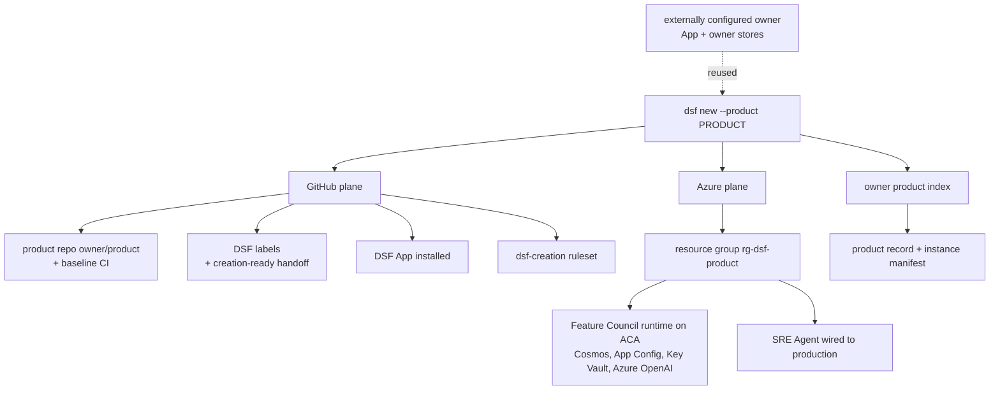

# Provision a factory

!!! warning "Configure the owner outside DSF"
    `dsf bootstrap` is not implemented in the .NET CLI. Before running `dsf new`, configure
    any owner services outside DSF. Export `DSF_OWNER_APPCONFIG_ENDPOINT` when publishing the
    product index. `dsf new` does not retrieve credentials from an owner Key Vault.

The factory CLI is `dsf`. Provisioning a product needs only `--product`:

```bash
dsf new --product <product>
```

Two inputs are inferred when omitted:

- `--owner` defaults to your `gh`-authenticated account. Pass `--owner <org>` for an organization.
- `--name-prefix` defaults to the product key, sanitized and randomized to an Azure-safe prefix.

Preview before provisioning:

```bash
dsf new --product <product> --dry-run
dsf new --product <product> --dry-run --write-plan
```

Full explicit form:

```bash
dsf new \
  --product microbi \
  --owner my-org \
  --name-prefix microbi \
  --visibility private \
  --location swedencentral \
  --creation-maturity low
```

Run `dsf new --help` for the full flag list.

For an immutable runtime image, first generate the instance manifest with
`--dry-run --write-plan`, set its `runtime.image` to a published commit tag or
digest, then run the same command without the dry-run flags. Repeated `dsf new`
invocations preserve that image, and the preview reports the selected image.

## Enable Decide sources and judgment

Source agents default to disabled. Supply `--decide-config <path>` to provision
only the selected Microsoft-native agents, seed their product-scoped
`agents.<kind>.enabled` flags, and wire the orchestrator's internal A2A endpoints.
The nonsecret configuration is retained under `runtime.decide` in the instance
definition and reused when a subsequent `dsf new` omits this option.

Example `decide.json` (replace endpoints and deployment names with existing,
authorized Azure model deployments):

```json
{
  "enabledSourceAgentKinds": ["webiq"],
  "webIqQuery": "checkout reliability problems and customer needs",
  "juryModels": [
    {"name":"value-check","provider":"openai","family":"gpt","endpoint":"https://models.example","deployment":"gpt-4o"},
    {"name":"challenge","provider":"deepseek","family":"deepseek","endpoint":"https://models.example","deployment":"DeepSeek-V3"},
    {"name":"independent-check","provider":"xai","family":"grok","endpoint":"https://models.example","deployment":"grok-4"}
  ],
  "juryTimeoutSeconds": 120,
  "deliberationRounds": 2,
  "lenses": [{"name":"cost","enabled":true,"weight":0.5}]
}
```

```bash
dsf new --product microbi --creation-maturity medium \
  --decide-config decide.json --dry-run --write-plan
```

Enabling any source requires three distinct juror families and deployment targets.
The supported Azure-hosted provider/family pairs are `openai/gpt`,
`deepseek/deepseek`, and `xai/grok`; three aliases for the same model are rejected
at configuration or response validation. The runtime uses Azure managed identity
against `/openai/v1/chat/completions`. This template does **not** create those
three external deployments or grant access on external accounts automatically.
Grant the runtime identity the appropriate model data-plane role on each account.
The synthesis/lens model remains the product's configured Azure OpenAI deployment.

All five lenses default to enabled with weight 1. `lenses` can override `value`,
`cost`, `feasibility`, `security`, or `strategic-fit`; at least one must remain
enabled. Rounds must be 1 or 2, weights finite and positive, and juror timeouts
1–600 seconds. Low creation maturity always escalates; medium/high permits
filing only for a valid unanimous-go jury outcome.

| Source | Required configuration | External prerequisite |
|---|---|---|
| `azuremonitor` | `azureMonitorWorkspaceId`, `azureMonitorQuery` (KQL) | Runtime identity authorized to query that Log Analytics workspace |
| `foundryiq` | `foundryIqSearchEndpoint`, `foundryIqKnowledgeBase`, `foundryIqQuery` | Azure AI Search knowledge base; Search Index Data Reader for the runtime identity |
| `webiq` | `webIqQuery` | `webiq-api-key` already present in the product Key Vault |

Azure Monitor queries must return exactly one table with nonempty string
`Reference` and `Summary` columns. For example, a Container Apps log query can
project `Reference=strcat("azuremonitor://", _ResourceId, "/", tostring(TimeGenerated))`
and `Summary=Log_s`. Choose references that identify the actual source record.
Partial or truncated query results fail rather than silently losing evidence.
For a local proof, `AZURE_TOKEN_CREDENTIALS=AzureCliCredential` selects the
existing `az login` identity without waiting for unavailable hosted credentials;
deployed apps continue to use managed identity.

FoundryIQ uses the **Search service root**, not a Foundry project endpoint.
WebIQ uses Microsoft's SDK-compatible `/v3/search/web` API. Do not put API keys,
tokens, or passwords in this file; unknown properties are rejected. Secret
seeding remains an operator prerequisite, not an implemented `dsf new` step.
For local WebIQ development only, `WEBIQ_API_KEY` overrides Key Vault resolution.

!!! note "Live progress during Azure deployment"
    The Azure provisioning step starts a deployment, polls it, and streams each resource as it
    starts and finishes. Tune cadence with `DSF_DEPLOY_POLL_INTERVAL` (seconds, default 5).
    `DSF_DEPLOY_TIMEOUT` bounds the wait (seconds, default 600; set `<= 0` to wait indefinitely).

## Prerequisites

Provisioning spans GitHub, Azure resources, and Azure RBAC. The principal running `dsf new`
needs:

- **Owner configuration:** `DSF_OWNER_KEYVAULT_URI` and `DSF_OWNER_APPCONFIG_ENDPOINT`
  are optional configuration inputs; `DSF_OWNER_APPCONFIG_ENDPOINT` (or
  `--owner-appconfig-endpoint`) is required for a live run to publish the product index.
- **GitHub:** `GH_TOKEN` or `GITHUB_TOKEN` that can create repositories under `--owner` and seed
  baseline CI. The CLI does not retrieve credentials from owner stores. Pass GitHub App and
  installation identifiers with `--github-app-id` and `--github-installation-id`, or set
  `DSF_GITHUB_APP_ID` and `DSF_GITHUB_INSTALLATION_ID`.
- **Spec Kit CLI:** `specify` on `PATH`, pinned by your operator image or workstation setup.
- **Azure subscription RBAC:** **Owner**, or **Contributor + User Access Administrator**, on
  the subscription.

!!! warning "Configure the owner App before `dsf new`"
    A live run cannot publish the product index if `DSF_OWNER_APPCONFIG_ENDPOINT` (or
    `--owner-appconfig-endpoint`) is missing. Configure the owner App Configuration service
    outside DSF, export its endpoint, then rerun `dsf new`.

## What gets provisioned

A complete, isolated factory for the product:

- a GitHub repository (`<owner>/<product>`) with baseline CI, DSF label taxonomy, DSF GitHub
  App installation, and the `dsf-creation` branch-protection ruleset,
- a dedicated Azure resource group (`rg-dsf-<product>`) with the runtime deployed from
  `infra/main.bicep`,
- a product record in the owner App Configuration index,
- an SRE Agent wired to production scope.


```mermaid
flowchart TD
    boot["externally configured owner<br/>App + owner stores"] -.->|reused| new
    new["dsf new --product PRODUCT"]
    new --> ghp["GitHub plane"]
    new --> azp["Azure plane"]
    new --> regp["owner product index"]
    ghp --> repo["product repo owner/product<br/>+ baseline CI"]
    ghp --> labels["DSF labels<br/>+ creation-ready handoff"]
    ghp --> appinst["DSF App installed"]
    ghp --> ruleset["dsf-creation ruleset"]
    azp --> rg["resource group rg-dsf-product"]
    rg --> runtime["Feature Council runtime on ACA<br/>Cosmos, App Config, Key Vault, Azure OpenAI"]
    rg --> sre["SRE Agent wired to production"]
    regp --> rec["product record + instance manifest"]
```

The persisted manifest lives under `config/instances/<product>.json`. Re-running `dsf new`
for the same product is idempotent.

## Seed product intent

A freshly provisioned factory is inert until a [product charter](operate.md#product-charter)
(`.dsf/charter.md`) lands on the product repository's default branch. On greenfield products,
`dsf new` offers to launch the charter interview:

```text
[dsf] Your factory has no intent yet. Seed its charter now? [Y/n]
```

Answer `Y` to run `dsf charter init --product <product>`. Non-interactive shells and
`--no-charter` skip the prompt and print the next command.

The charter path is:

```text
dsf new  →  charter PR  →  review & merge  →  dsf sweep  →  dsf charter implement
```

See [Operate it](operate.md) for charter operations.
