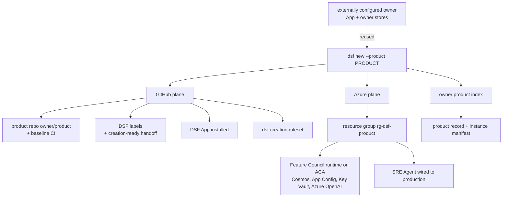

# Provision a factory

!!! warning "Configure the owner outside DSF"
    `dsf bootstrap` is not implemented in the .NET CLI. Before running `dsf new`, configure
    any owner services outside DSF. Export `DSF_OWNER_APPCONFIG_ENDPOINT` when publishing the
    product index. `dsf new` does not retrieve credentials from an owner Key Vault.

The factory CLI is `dsf`. Provisioning a product needs only `--product`:

```bash
dsf new --product <product>
```

Two inputs are inferred when omitted:

- `--owner` defaults to your `gh`-authenticated account. Pass `--owner <org>` for an organization.
- `--name-prefix` defaults to the product key, sanitized and randomized to an Azure-safe prefix.

Preview before provisioning:

```bash
dsf new --product <product> --dry-run
dsf new --product <product> --dry-run --write-plan
```

Full explicit form:

```bash
dsf new \
  --product microbi \
  --owner my-org \
  --name-prefix microbi \
  --visibility private \
  --location swedencentral \
  --creation-maturity low
```

Run `dsf new --help` for the full flag list.

!!! note "Live progress during Azure deployment"
    The Azure provisioning step starts a deployment, polls it, and streams each resource as it
    starts and finishes. Tune cadence with `DSF_DEPLOY_POLL_INTERVAL` (seconds, default 5).
    `DSF_DEPLOY_TIMEOUT` bounds the wait (seconds, default 600; set `<= 0` to wait indefinitely).

## Prerequisites

Provisioning spans GitHub, Azure resources, and Azure RBAC. The principal running `dsf new`
needs:

- **Owner configuration:** `DSF_OWNER_KEYVAULT_URI` and `DSF_OWNER_APPCONFIG_ENDPOINT`
  are optional configuration inputs; `DSF_OWNER_APPCONFIG_ENDPOINT` (or
  `--owner-appconfig-endpoint`) is required for a live run to publish the product index.
- **GitHub:** `GH_TOKEN` or `GITHUB_TOKEN` that can create repositories under `--owner` and seed
  baseline CI. The CLI does not retrieve credentials from owner stores. Pass GitHub App and
  installation identifiers with `--github-app-id` and `--github-installation-id`, or set
  `DSF_GITHUB_APP_ID` and `DSF_GITHUB_INSTALLATION_ID`.
- **Spec Kit CLI:** `specify` on `PATH`, pinned by your operator image or workstation setup.
- **Azure subscription RBAC:** **Owner**, or **Contributor + User Access Administrator**, on
  the subscription.

!!! warning "Configure the owner App before `dsf new`"
    A live run cannot publish the product index if `DSF_OWNER_APPCONFIG_ENDPOINT` (or
    `--owner-appconfig-endpoint`) is missing. Configure the owner App Configuration service
    outside DSF, export its endpoint, then rerun `dsf new`.

## What gets provisioned

A complete, isolated factory for the product:

- a GitHub repository (`<owner>/<product>`) with baseline CI, DSF label taxonomy, DSF GitHub
  App installation, and the `dsf-creation` branch-protection ruleset,
- a dedicated Azure resource group (`rg-dsf-<product>`) with the runtime deployed from
  `infra/main.bicep`,
- a product record in the owner App Configuration index,
- an SRE Agent wired to production scope.


```mermaid
flowchart TD
    boot["externally configured owner<br/>App + owner stores"] -.->|reused| new
    new["dsf new --product PRODUCT"]
    new --> ghp["GitHub plane"]
    new --> azp["Azure plane"]
    new --> regp["owner product index"]
    ghp --> repo["product repo owner/product<br/>+ baseline CI"]
    ghp --> labels["DSF labels<br/>+ creation-ready handoff"]
    ghp --> appinst["DSF App installed"]
    ghp --> ruleset["dsf-creation ruleset"]
    azp --> rg["resource group rg-dsf-product"]
    rg --> runtime["Feature Council runtime on ACA<br/>Cosmos, App Config, Key Vault, Azure OpenAI"]
    rg --> sre["SRE Agent wired to production"]
    regp --> rec["product record + instance manifest"]
```

The persisted manifest lives under `config/instances/<product>.json`. Re-running `dsf new`
for the same product is idempotent.

## Seed product intent

A freshly provisioned factory is inert until a [product charter](operate.md#product-charter)
(`.dsf/charter.md`) lands on the product repository's default branch. On greenfield products,
`dsf new` offers to launch the charter interview:

```text
[dsf] Your factory has no intent yet. Seed its charter now? [Y/n]
```

Answer `Y` to run `dsf charter init --product <product>`. Non-interactive shells and
`--no-charter` skip the prompt and print the next command.

The charter path is:

```text
dsf new  →  charter PR  →  review & merge  →  dsf sweep  →  dsf charter implement
```

See [Operate it](operate.md) for charter operations.
