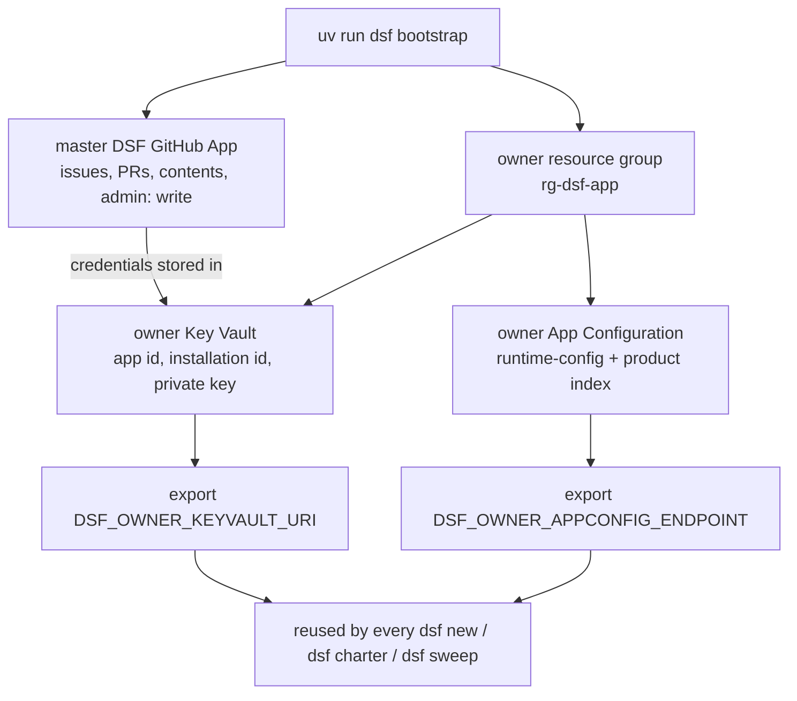

# Quickstart

Dark Software Factory (DSF) is the **blueprint**, not a running factory. You install the
tooling once, then stamp out an isolated factory per product with a single command. This
guide takes you from a fresh clone to a healthy checkout.

For the big picture (the decide → build → operate loop and the governance harness) read
[The loop](../concept/the-loop.md) and [The harness](../concept/the-harness.md). For the
"why" behind the design, see the
[ADRs](https://github.com/JoranBergfeld/dark-software-factory/tree/main/docs/adr).

## Prerequisites

- **Python 3.12+** and [**uv**](https://docs.astral.sh/uv/). Every command runs through
  `uv run` — never call bare `python`/`pip`/`pytest`.
- The [**GitHub CLI**](https://cli.github.com/) (`gh`), authenticated with `gh auth login`.
  DSF uses it to infer the repo owner (when you omit `--owner`) and to create the product
  repo and wire the Creation phase.
- For a real (non `--dry-run`) provision: the
  [**Azure CLI**](https://learn.microsoft.com/cli/azure/) (`az`) logged in to a subscription
  (`az login`).

## Install

```bash
make install   # uv sync --all-packages
```

Verify your checkout is healthy:

```bash
make test          # uv run pytest -q
make lint          # uv run ruff check .
make lint-imports  # enforce the cross-member import boundaries
```

## Bootstrap the owner (one-time)

Before you can stamp out any product, the **owner** account needs one shared, long-lived
identity and a home for its secrets. `dsf bootstrap` creates that once; every later
`dsf new`, `dsf charter`, and `dsf sweep` reuses it:

```bash
uv run dsf bootstrap \
  --app-name "DSF <your-org>" \   # GitHub App name (globally unique)
  --keyvault-name dsf-owner-kv \  # owner Key Vault for the App credentials
  --appconfig-name dsf-owner-cfg  # owner App Configuration (runtime-config + product index)
  # --resource-group rg-dsf-app   # default; holds the owner Key Vault + App Config
  # --location swedencentral      # default Azure region
```

It opens GitHub in your browser to create the **master DSF GitHub App**, then provisions the
owner-level Azure resources and stores the App credentials in them:



When it finishes it prints two values to export. Keep them in your shell (or CI) so the
provisioning and runtime commands can find the App and the owner index:

```bash
export DSF_OWNER_KEYVAULT_URI=https://dsf-owner-kv.vault.azure.net/
export DSF_OWNER_APPCONFIG_ENDPOINT=https://dsf-owner-cfg.azconfig.io
```

This runs **once per owner**, not once per product. Re-running it is safe (idempotent).

Next: [provision a factory](provision-a-factory.md).
