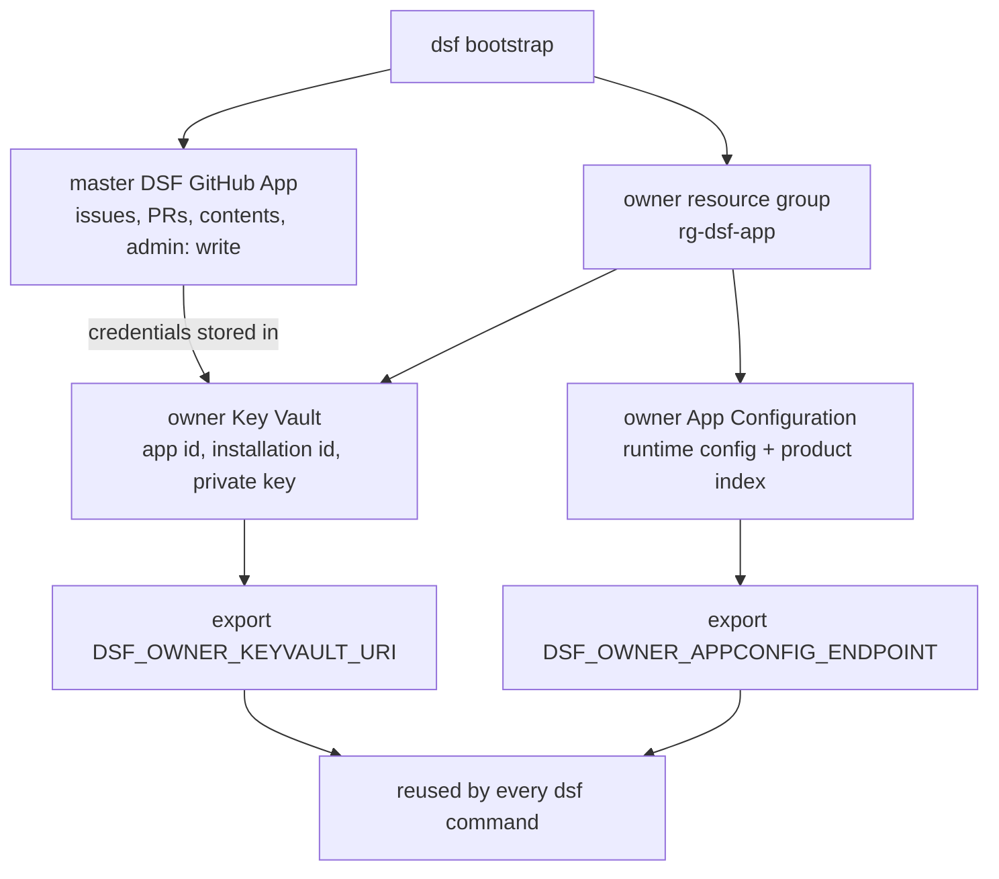

# Quickstart

Dark Software Factory (DSF) is the **blueprint**, not a running factory. Install the packaged
CLI once, then stamp out an isolated factory per product with `dsf new`.

For the big picture, read [The loop](../concept/the-loop.md) and
[The harness](../concept/the-harness.md). For design history, see the
[ADRs](https://github.com/JoranBergfeld/dark-software-factory/tree/main/docs/adr).

## Prerequisites

- [.NET SDK](https://dotnet.microsoft.com/download) matching `dotnet/global.json` for
  contributor builds.
- The [GitHub CLI](https://cli.github.com/) (`gh`), authenticated with `gh auth login`, for
  repository ownership and GitHub release access.
- The [Azure CLI](https://learn.microsoft.com/cli/azure/) (`az`) logged in to the target
  subscription for real provisioning.
- The packaged DSF CLI, installed as a global tool or from a self-contained release archive.

## Install DSF

Global tool install:

```bash
dotnet tool install --global DarkSoftwareFactory.Cli
```

Pinned install:

```bash
dotnet tool install --global DarkSoftwareFactory.Cli --version <version>
```

Self-contained install:

1. Download the matching GitHub Release archive: `dsf-cli-linux-x64.tar.gz`,
   `dsf-cli-linux-arm64.tar.gz`, `dsf-cli-osx-x64.tar.gz`, `dsf-cli-osx-arm64.tar.gz`,
   `dsf-cli-win-x64.zip`, or `dsf-cli-win-arm64.zip`.
2. Verify it with [Verify a release](verify-release.md).
3. Extract it and put the extracted directory on `PATH`.
4. Run `dsf --help`.

## Verify a checkout

Contributors validate the active implementation from the .NET workspace:

```bash
cd dotnet
dotnet restore Dsf.sln --locked-mode
dotnet build Dsf.sln --no-restore
dotnet test Dsf.sln --no-build
```

## Bootstrap the owner once

Before provisioning any product, the **owner** account needs one shared GitHub App and a home
for its secrets. `dsf bootstrap` creates that once; later `dsf new`, `dsf charter`, and
`dsf sweep` reuse it.

```bash
dsf bootstrap \
  --app-name "DSF <your-org>" \
  --keyvault-name dsf-owner-kv \
  --appconfig-name dsf-owner-cfg
```

It opens GitHub in your browser to create the master DSF GitHub App, then provisions the
owner-level Azure resources and stores the App credentials.


```mermaid
flowchart TD
    op["dsf bootstrap"] --> app["master DSF GitHub App<br/>issues, PRs, contents, admin: write"]
    op --> rg["owner resource group<br/>rg-dsf-app"]
    rg --> kv["owner Key Vault<br/>app id, installation id, private key"]
    rg --> cfg["owner App Configuration<br/>runtime config + product index"]
    app -->|credentials stored in| kv
    kv --> e1["export DSF_OWNER_KEYVAULT_URI"]
    cfg --> e2["export DSF_OWNER_APPCONFIG_ENDPOINT"]
    e1 --> reuse["reused by every dsf command"]
    e2 --> reuse
```

Export the values printed at the end:

```bash
export DSF_OWNER_KEYVAULT_URI=https://dsf-owner-kv.vault.azure.net/
export DSF_OWNER_APPCONFIG_ENDPOINT=https://dsf-owner-cfg.azconfig.io
```

Next: [provision a factory](provision-a-factory.md).
