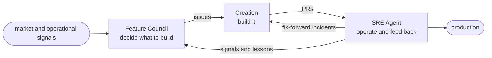

# Dark Software Factory

> An autonomous software factory: software that decides what to build, builds it, and
> keeps it running. People stay outside the process and govern it.

A "dark factory" in manufacturing runs with the lights off: the line keeps moving and nobody
stands on the floor. **Dark Software Factory (DSF)** takes that idea to software. Deciding
what to build, building it, and operating it all run on agents.

People don't work the line. They stay outside it and do two things:

- **Tend the harness** — the guardrails, policy, and configuration that keep the agents safe
  and grounded.
- **Steer** — decide what matters right now, and where to point the factory.

The job changes from running the assembly line to governing the factory around it. How far
that goes is your call; the goal is as much autonomy as each phase can safely take.

## The loop

DSF runs as a loop of three phases. Each one has a single job, hands off to the next, and
what happens in production comes back to the start.

Every product gets its own copy of this loop, fully isolated, stamped out by a single
command. This repository is the blueprint, not a factory that's already running.

## Where to next

- **New to the idea?** Read [The loop](concept/the-loop.md) and
  [The harness](concept/the-harness.md).
- **Want to run it?** Start with the [Quickstart](get-started/quickstart.md), then
  [provision a factory](get-started/provision-a-factory.md) and
  [operate it](get-started/operate.md).
- **Each phase in depth:** [Feature Council](concept/feature-council.md),
  [Product Charter](concept/product-charter.md),
  [Creation phase](concept/creation.md), [SRE Agent](concept/sre-agent.md).
