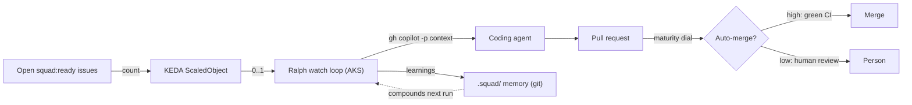

# Coding Squad: Ralph Watch Loop on AKS + KEDA Implementation Plan

> **For agentic workers:** REQUIRED SUB-SKILL: Use superpowers:subagent-driven-development (recommended) or superpowers:executing-plans to implement this plan task-by-task. Steps use checkbox (`- [ ]`) syntax for tracking.

**Goal:** Replace the one-shot `squad triage` step and the Cloud Agent auto-assignment with a standing Ralph watch loop, deployed per product on its own AKS cluster and scaled 0..1 by KEDA off the open `squad:ready` issue count, governed by a per-product maturity dial.

**Architecture:** DSF owns the deployment harness and governance; squad owns the loop. The provisioner drops `squad_copilot`, keeps `squad_init`, and replaces the one-shot `squad_triage` with a rendered Ralph Deployment + KEDA ScaledObject (applied to a per-product AKS cluster stood up by a new Bicep module) plus a governance step that toggles auto-merge. Manifest rendering mirrors the existing `runtime_render` pattern; provisioner steps mirror the existing `ProvisionStep` pattern.

**Tech Stack:** Python 3.12, pydantic (instance spec), pytest (uv workspace, no `__init__.py` in test dirs, importlib mode), Bicep (AKS + KEDA), Kubernetes manifests (Deployment, KEDA ScaledObject), `gh`/`az`/`kubectl` through the provisioner's injectable runner.

**Reference spec:** `docs/superpowers/specs/2026-06-19-coding-squad-ralph-aks-keda-design.md`
**Reference ADR:** `docs/adr/0012-coding-squad-ralph-aks-keda.md`

**Conventions (verified this session):**
- `python` is not on PATH; use `uv run python` / `uv run pytest`.
- Validation gauntlet: `uv run pytest -q`, `uv run ruff check .`, `uv run lint-imports`.
- Humanizer scan on any prose/docs (no em/en-dashes or curly quotes):
  `grep -nP "[\x{2014}\x{2013}\x{2018}\x{2019}\x{201C}\x{201D}]" <files>`
- Commit trailer: `Co-authored-by: Copilot <223556219+Copilot@users.noreply.github.com>`
- Ruff select is `E,F,I,UP,B`; do not add `# noqa: BLE001`.

---

## Task 1: Add the `squad_maturity` dial to InstanceSpec

**Files:**
- Modify: `cli/src/dsf/instance/spec.py` (the `InstanceSpec` model, around line 28-50)
- Test: `cli/tests/instance/test_spec.py`

- [ ] **Step 1: Write the failing tests**

Append to `cli/tests/instance/test_spec.py`:

```python
import pytest

from dsf.instance.spec import InstanceSpec


def test_squad_maturity_defaults_to_low():
    spec = InstanceSpec(product="demo", owner="acme")
    assert spec.squad_maturity == "low"


def test_squad_maturity_accepts_high():
    spec = InstanceSpec(product="demo", owner="acme", squad_maturity="high")
    assert spec.squad_maturity == "high"


def test_squad_maturity_rejects_unknown_value():
    with pytest.raises(ValueError):
        InstanceSpec(product="demo", owner="acme", squad_maturity="medium")
```

- [ ] **Step 2: Run the tests to verify they fail**

Run: `uv run pytest cli/tests/instance/test_spec.py -q -k squad_maturity`
Expected: FAIL (`squad_maturity` is not a field / no validation error raised).

- [ ] **Step 3: Add the field and validator**

In `cli/src/dsf/instance/spec.py`, add the field to `InstanceSpec` after `name_prefix` (line 38):

```python
    squad_maturity: str = "low"
```

And add this validator method to `InstanceSpec` (next to `_validate_name_prefix`):

```python
    @field_validator("squad_maturity")
    @classmethod
    def _validate_squad_maturity(cls, value: str) -> str:
        if value not in {"low", "high"}:
            raise ValueError(
                f"squad_maturity must be 'low' or 'high', got {value!r}"
            )
        return value
```

- [ ] **Step 4: Run the tests to verify they pass**

Run: `uv run pytest cli/tests/instance/test_spec.py -q -k squad_maturity`
Expected: PASS (3 passed).

- [ ] **Step 5: Commit**

```bash
git add cli/src/dsf/instance/spec.py cli/tests/instance/test_spec.py
git commit -m "feat(instance): add squad_maturity dial to InstanceSpec

Co-authored-by: Copilot <223556219+Copilot@users.noreply.github.com>"
```

---

## Task 2: Issue-count helper for the KEDA metric

**Files:**
- Create: `cli/src/dsf/instance/issue_count.py`
- Test: `cli/tests/instance/test_issue_count.py`

The KEDA `metrics-api` scaler reads the count of open `squad:ready` issues from a
small exporter. This is the pure parsing logic that exporter uses; it parses the
output of `gh issue list --label squad:ready --state open --json number`.

- [ ] **Step 1: Write the failing tests**

Create `cli/tests/instance/test_issue_count.py`:

```python
"""Tests for the open-handoff-issue count helper (KEDA metric source)."""

from __future__ import annotations

from dsf.instance.issue_count import open_handoff_issue_count


def test_counts_issues_in_gh_json_array():
    payload = '[{"number": 1}, {"number": 7}, {"number": 12}]'
    assert open_handoff_issue_count(payload) == 3


def test_empty_array_is_zero():
    assert open_handoff_issue_count("[]") == 0


def test_blank_or_whitespace_is_zero():
    assert open_handoff_issue_count("") == 0
    assert open_handoff_issue_count("   \n") == 0


def test_malformed_json_is_zero():
    assert open_handoff_issue_count("not json") == 0


def test_non_array_json_is_zero():
    assert open_handoff_issue_count('{"number": 1}') == 0
```

- [ ] **Step 2: Run the tests to verify they fail**

Run: `uv run pytest cli/tests/instance/test_issue_count.py -q`
Expected: FAIL (`ModuleNotFoundError: dsf.instance.issue_count`).

- [ ] **Step 3: Write the implementation**

Create `cli/src/dsf/instance/issue_count.py`:

```python
"""Open-handoff-issue count: the KEDA scale metric source for the Ralph loop.

The exporter shells ``gh issue list --label squad:ready --state open --json
number`` and feeds the JSON here. KEDA scales the Ralph Deployment to 1 while the
count is >= 1 and back to 0 when it returns to 0. Parsing is total: any malformed
or unexpected input counts as zero work, so a transient ``gh`` hiccup scales the
loop down rather than wedging it up.
"""

from __future__ import annotations

import json


def open_handoff_issue_count(issues_json: str) -> int:
    """Return the number of open handoff issues in a ``gh issue list --json`` array.

    Returns 0 for blank, malformed, or non-array input.
    """
    if not issues_json or not issues_json.strip():
        return 0
    try:
        parsed = json.loads(issues_json)
    except json.JSONDecodeError:
        return 0
    if not isinstance(parsed, list):
        return 0
    return len(parsed)
```

- [ ] **Step 4: Run the tests to verify they pass**

Run: `uv run pytest cli/tests/instance/test_issue_count.py -q`
Expected: PASS (5 passed).

- [ ] **Step 5: Commit**

```bash
git add cli/src/dsf/instance/issue_count.py cli/tests/instance/test_issue_count.py
git commit -m "feat(instance): add open-handoff-issue count helper for KEDA metric

Co-authored-by: Copilot <223556219+Copilot@users.noreply.github.com>"
```

---

## Task 3: Governance mapping (maturity dial -> gh commands)

**Files:**
- Create: `cli/src/dsf/instance/squad_governance.py`
- Test: `cli/tests/instance/test_squad_governance.py`

The maturity dial toggles the repo's auto-merge capability. Low maturity disables
auto-merge so a human merges every squad PR; high maturity enables auto-merge so a
PR that passes required CI checks merges on its own.

- [ ] **Step 1: Write the failing tests**

Create `cli/tests/instance/test_squad_governance.py`:

```python
"""Tests for the squad maturity-dial governance commands."""

from __future__ import annotations

from dsf.instance.spec import InstanceSpec
from dsf.instance.squad_governance import governance_commands


def _spec(maturity: str) -> InstanceSpec:
    return InstanceSpec(product="demo", owner="acme", squad_maturity=maturity)


def test_low_maturity_disables_auto_merge():
    cmds = governance_commands(_spec("low"))
    assert cmds == [
        ["gh", "api", "--method", "PATCH", "repos/acme/demo", "-F", "allow_auto_merge=false"]
    ]


def test_high_maturity_enables_auto_merge():
    cmds = governance_commands(_spec("high"))
    assert cmds == [
        ["gh", "api", "--method", "PATCH", "repos/acme/demo", "-F", "allow_auto_merge=true"]
    ]
```

- [ ] **Step 2: Run the tests to verify they fail**

Run: `uv run pytest cli/tests/instance/test_squad_governance.py -q`
Expected: FAIL (`ModuleNotFoundError: dsf.instance.squad_governance`).

- [ ] **Step 3: Write the implementation**

Create `cli/src/dsf/instance/squad_governance.py`:

```python
"""Squad governance: map the per-product maturity dial to repo settings.

Low maturity disables auto-merge (a human merges every squad PR); high maturity
enables it (a PR that passes required CI merges on its own). The dial governs the
repo capability, not Ralph's behaviour: Ralph always opens PRs, and this decides
what may happen to them. Applied at provisioning and re-applied whenever the dial
changes while the factory runs.
"""

from __future__ import annotations

from dsf.instance.spec import InstanceSpec


def governance_commands(spec: InstanceSpec) -> list[list[str]]:
    """Return the ``gh`` commands that apply ``spec.squad_maturity`` to the repo."""
    enabled = "true" if spec.squad_maturity == "high" else "false"
    return [
        [
            "gh", "api", "--method", "PATCH", f"repos/{spec.github_repo()}",
            "-F", f"allow_auto_merge={enabled}",
        ]
    ]
```

- [ ] **Step 4: Run the tests to verify they pass**

Run: `uv run pytest cli/tests/instance/test_squad_governance.py -q`
Expected: PASS (2 passed).

- [ ] **Step 5: Commit**

```bash
git add cli/src/dsf/instance/squad_governance.py cli/tests/instance/test_squad_governance.py
git commit -m "feat(instance): map squad maturity dial to repo auto-merge commands

Co-authored-by: Copilot <223556219+Copilot@users.noreply.github.com>"
```

---

## Task 4: Render the squad AKS manifest bundle

**Files:**
- Create: `cli/src/dsf/instance/squad_render.py`
- Test: `cli/tests/instance/test_squad_render.py`

Mirrors `runtime_render.render_runtime_bundle`: a pure render that writes the Ralph
Deployment, the KEDA ScaledObject, and the issue-count exporter into
`config/instances/<product>.runtime/squad/`. Reuses `runtime_dir` from
`runtime_render`.

- [ ] **Step 1: Write the failing tests**

Create `cli/tests/instance/test_squad_render.py`:

```python
"""Tests for render_squad_bundle (per-product Ralph + KEDA manifests)."""

from __future__ import annotations

from dsf.instance.provisioner import InstanceProvisioner
from dsf.instance.runtime_render import runtime_dir
from dsf.instance.spec import InstanceManifest, InstanceSpec
from dsf.instance.squad_render import render_squad_bundle


def _manifest(tmp_path) -> InstanceManifest:
    spec = InstanceSpec(product="microbi", owner="acme", name_prefix="microbi")
    plan = InstanceProvisioner(spec, repo_root=tmp_path).plan()
    return InstanceManifest(spec=spec, plan=plan, executed=False, azure=None)


def test_render_writes_three_manifests_under_squad_dir(tmp_path):
    bundle = render_squad_bundle(_manifest(tmp_path), repo_root=tmp_path)
    assert bundle.squad_dir == runtime_dir("microbi", tmp_path) / "squad"
    assert bundle.deployment_path.name == "ralph-deployment.yaml"
    assert bundle.scaledobject_path.name == "ralph-scaledobject.yaml"
    assert bundle.exporter_path.name == "issue-exporter.yaml"
    assert bundle.deployment_path.is_file()
    assert bundle.scaledobject_path.is_file()
    assert bundle.exporter_path.is_file()


def test_deployment_runs_ralph_watch_with_git_notes_backend(tmp_path):
    bundle = render_squad_bundle(_manifest(tmp_path), repo_root=tmp_path)
    text = bundle.deployment_path.read_text(encoding="utf-8")
    assert "squad" in text and "watch" in text and "--execute" in text
    assert "--state-backend" in text and "git-notes" in text
    assert "kind: Deployment" in text


def test_scaledobject_scales_zero_to_one_on_issue_count(tmp_path):
    bundle = render_squad_bundle(_manifest(tmp_path), repo_root=tmp_path)
    text = bundle.scaledobject_path.read_text(encoding="utf-8")
    assert "kind: ScaledObject" in text
    assert "minReplicaCount: 0" in text
    assert "maxReplicaCount: 1" in text
    assert "metrics-api" in text


def test_manifests_are_namespaced_to_the_product(tmp_path):
    bundle = render_squad_bundle(_manifest(tmp_path), repo_root=tmp_path)
    for path in (bundle.deployment_path, bundle.scaledobject_path, bundle.exporter_path):
        assert "microbi" in path.read_text(encoding="utf-8")


def test_exporter_manifest_creates_the_namespace(tmp_path):
    bundle = render_squad_bundle(_manifest(tmp_path), repo_root=tmp_path)
    text = bundle.exporter_path.read_text(encoding="utf-8")
    assert "kind: Namespace" in text
    assert "name: squad-microbi" in text
```

- [ ] **Step 2: Run the tests to verify they fail**

Run: `uv run pytest cli/tests/instance/test_squad_render.py -q`
Expected: FAIL (`ModuleNotFoundError: dsf.instance.squad_render`).

- [ ] **Step 3: Write the implementation**

Create `cli/src/dsf/instance/squad_render.py`:

```python
"""Render the per-product squad execution bundle (Ralph + KEDA + exporter).

For an :class:`~dsf.instance.spec.InstanceManifest`, write three Kubernetes
manifests into ``config/instances/<product>.runtime/squad/``:

- ``ralph-deployment.yaml`` -- the Ralph watch loop (``squad watch --execute``)
  with a persistent ``git-notes`` state backend, so per-member ``.squad/`` memory
  survives the ephemeral, scale-to-zero pod.
- ``ralph-scaledobject.yaml`` -- a KEDA ScaledObject scaling the Deployment 0..1
  off the open ``squad:ready`` issue count (the ``metrics-api`` scaler reads the
  exporter).
- ``issue-exporter.yaml`` -- the small exporter Deployment + Service that serves
  the issue count for KEDA.

Secrets (the GitHub App token) are NOT rendered: pods read them from Key Vault via
AKS workload identity (ADR 0012). Image references mirror ``runtime_image`` -- they
are deployment artifacts, not built here.
"""

from __future__ import annotations

from dataclasses import dataclass
from pathlib import Path

from dsf.contracts.handoff import HANDOFF_LABEL
from dsf.instance.runtime_render import runtime_dir
from dsf.instance.spec import InstanceManifest

RALPH_IMAGE = "ghcr.io/joranbergfeld/dsf-squad-ralph:latest"
EXPORTER_IMAGE = "ghcr.io/joranbergfeld/dsf-issue-exporter:latest"


@dataclass(frozen=True)
class SquadBundle:
    """Paths to the rendered squad manifests for one product."""

    squad_dir: Path
    deployment_path: Path
    scaledobject_path: Path
    exporter_path: Path


def _render_deployment(*, product: str, repo: str) -> str:
    return (
        "# ralph-deployment.yaml -- GENERATED by dsf (render_squad_bundle).\n"
        f"# Ralph watch loop for product '{product}' (ADR 0012).\n"
        "apiVersion: apps/v1\n"
        "kind: Deployment\n"
        "metadata:\n"
        f"  name: ralph-{product}\n"
        f"  namespace: squad-{product}\n"
        "spec:\n"
        "  replicas: 0\n"
        "  selector:\n"
        f"    matchLabels: {{app: ralph-{product}}}\n"
        "  template:\n"
        "    metadata:\n"
        f"      labels: {{app: ralph-{product}, azure.workload.identity/use: \"true\"}}\n"
        "    spec:\n"
        "      containers:\n"
        f"        - name: ralph\n"
        f"          image: {RALPH_IMAGE}\n"
        "          args:\n"
        "            - squad\n"
        "            - watch\n"
        "            - --execute\n"
        "            - --state-backend\n"
        "            - git-notes\n"
        "            - --label\n"
        f"            - {HANDOFF_LABEL}\n"
        "          env:\n"
        f"            - {{name: SQUAD_REPO, value: {repo}}}\n"
    )


def _render_scaledobject(*, product: str) -> str:
    return (
        "# ralph-scaledobject.yaml -- GENERATED by dsf (render_squad_bundle).\n"
        f"# KEDA scales Ralph 0..1 on the open '{HANDOFF_LABEL}' issue count (ADR 0012).\n"
        "apiVersion: keda.sh/v1alpha1\n"
        "kind: ScaledObject\n"
        "metadata:\n"
        f"  name: ralph-{product}\n"
        f"  namespace: squad-{product}\n"
        "spec:\n"
        f"  scaleTargetRef:\n"
        f"    name: ralph-{product}\n"
        "  minReplicaCount: 0\n"
        "  maxReplicaCount: 1\n"
        "  triggers:\n"
        "    - type: metrics-api\n"
        "      metadata:\n"
        f"        url: http://issue-exporter.squad-{product}.svc/metrics\n"
        "        valueLocation: count\n"
        "        targetValue: \"1\"\n"
    )


def _render_exporter(*, product: str, repo: str) -> str:
    return (
        "# issue-exporter.yaml -- GENERATED by dsf (render_squad_bundle).\n"
        f"# Serves the open '{HANDOFF_LABEL}' issue count for KEDA (ADR 0012).\n"
        "apiVersion: v1\n"
        "kind: Namespace\n"
        "metadata:\n"
        f"  name: squad-{product}\n"
        "---\n"
        "apiVersion: apps/v1\n"
        "kind: Deployment\n"
        "metadata:\n"
        f"  name: issue-exporter\n"
        f"  namespace: squad-{product}\n"
        "spec:\n"
        "  replicas: 1\n"
        "  selector:\n"
        "    matchLabels: {app: issue-exporter}\n"
        "  template:\n"
        "    metadata:\n"
        "      labels: {app: issue-exporter, azure.workload.identity/use: \"true\"}\n"
        "    spec:\n"
        "      containers:\n"
        f"        - name: exporter\n"
        f"          image: {EXPORTER_IMAGE}\n"
        "          env:\n"
        f"            - {{name: SQUAD_REPO, value: {repo}}}\n"
        f"            - {{name: HANDOFF_LABEL, value: {HANDOFF_LABEL}}}\n"
        "---\n"
        "apiVersion: v1\n"
        "kind: Service\n"
        "metadata:\n"
        f"  name: issue-exporter\n"
        f"  namespace: squad-{product}\n"
        "spec:\n"
        "  selector: {app: issue-exporter}\n"
        "  ports:\n"
        "    - {port: 80, targetPort: 8080}\n"
    )


def render_squad_bundle(
    manifest: InstanceManifest, *, repo_root: Path | None = None
) -> SquadBundle:
    """Render the Ralph Deployment, KEDA ScaledObject, and exporter for ``manifest``."""
    spec = manifest.spec
    product = spec.product
    repo = spec.github_repo()
    sdir = runtime_dir(product, repo_root) / "squad"
    sdir.mkdir(parents=True, exist_ok=True)
    deployment_path = sdir / "ralph-deployment.yaml"
    scaledobject_path = sdir / "ralph-scaledobject.yaml"
    exporter_path = sdir / "issue-exporter.yaml"
    deployment_path.write_text(_render_deployment(product=product, repo=repo), encoding="utf-8")
    scaledobject_path.write_text(_render_scaledobject(product=product), encoding="utf-8")
    exporter_path.write_text(_render_exporter(product=product, repo=repo), encoding="utf-8")
    return SquadBundle(
        squad_dir=sdir,
        deployment_path=deployment_path,
        scaledobject_path=scaledobject_path,
        exporter_path=exporter_path,
    )


__all__ = ["SquadBundle", "render_squad_bundle"]
```

- [ ] **Step 4: Run the tests to verify they pass**

Run: `uv run pytest cli/tests/instance/test_squad_render.py -q`
Expected: PASS (5 passed).

- [ ] **Step 5: Commit**

```bash
git add cli/src/dsf/instance/squad_render.py cli/tests/instance/test_squad_render.py
git commit -m "feat(instance): render the per-product Ralph + KEDA squad bundle

Co-authored-by: Copilot <223556219+Copilot@users.noreply.github.com>"
```

---

## Task 5: Rewire the provisioner (drop squad_copilot, deploy Ralph, govern)

**Files:**
- Modify: `cli/src/dsf/instance/provisioner.py` (the `plan()` step list ~line 112-131; the `apply()` step handling ~line 217-245)
- Test: `cli/tests/instance/test_provisioner.py`

Remove `squad_copilot`. Replace the one-shot `squad_triage` with `deploy_squad_ralph`
(renders the bundle in dry-run; in execute pulls AKS credentials and `kubectl apply`s
the manifests) and `squad_governance` (applies the maturity-dial `gh` commands via
the existing `commands` branch).

- [ ] **Step 1: Write the failing tests**

In `cli/tests/instance/test_provisioner.py`, update the step-order test (the
`test_plan_step_order_and_names` list at line 23-35) to:

```python
    assert [s.name for s in plan.steps] == [
        "create_repo",
        "create_labels",
        "squad_init",
        "create_resource_group",
        "provision_azure",
        "register_product",
        "deploy_council",
        "deploy_squad_ralph",
        "squad_governance",
        "onboard_sre_agent",
        "write_config",
    ]
```

And append these tests:

```python
def test_squad_copilot_step_is_gone():
    plan = InstanceProvisioner(_spec()).plan()
    assert "squad_copilot" not in {s.name for s in plan.steps}
    assert "squad_triage" not in {s.name for s in plan.steps}


def test_squad_governance_low_maturity_disables_auto_merge():
    spec = InstanceSpec(product="demo", owner="acme", squad_maturity="low")
    plan = InstanceProvisioner(spec).plan()
    gov = next(s for s in plan.steps if s.name == "squad_governance")
    assert gov.commands == [
        ["gh", "api", "--method", "PATCH", "repos/acme/demo", "-F", "allow_auto_merge=false"]
    ]


def test_deploy_squad_ralph_renders_bundle_in_dry_run(tmp_path):
    spec = InstanceSpec(product="demo", owner="acme")
    InstanceProvisioner(spec, repo_root=tmp_path).apply(execute=False)
    squad_dir = tmp_path / "config" / "instances" / "demo.runtime" / "squad"
    assert (squad_dir / "ralph-deployment.yaml").is_file()
    assert (squad_dir / "ralph-scaledobject.yaml").is_file()
    assert (squad_dir / "issue-exporter.yaml").is_file()


def test_deploy_squad_ralph_applies_manifests_on_execute(tmp_path):
    spec = InstanceSpec(product="demo", owner="acme")
    run = MagicMock(return_value=subprocess.CompletedProcess([], 0, stdout="{}", stderr=""))
    InstanceProvisioner(spec, run=run, repo_root=tmp_path).apply(execute=True)
    calls = [c.args[0] for c in run.call_args_list]
    assert any(cmd[:3] == ["az", "aks", "get-credentials"] for cmd in calls)
    assert any(cmd[:2] == ["kubectl", "apply"] for cmd in calls)
    assert any(
        cmd[:5] == ["gh", "api", "--method", "PATCH", "repos/acme/demo"] for cmd in calls
    )
```

- [ ] **Step 2: Run the tests to verify they fail**

Run: `uv run pytest cli/tests/instance/test_provisioner.py -q`
Expected: FAIL (old step list still has `squad_copilot`/`squad_triage`; new steps absent).

- [ ] **Step 3: Edit `plan()` -- replace the squad steps**

In `cli/src/dsf/instance/provisioner.py`, add the import near the other instance
imports (after line 25):

```python
from dsf.instance.squad_governance import governance_commands
```

Remove the `squad_copilot` and `squad_triage` `ProvisionStep(...)` blocks (lines
118-131) -- keep `squad_init`. Then add these two steps to the `steps` list, placed
immediately after the `deploy_council` step (after line 172):

```python
            ProvisionStep(
                name="deploy_squad_ralph",
                description=(
                    f"Render + apply the Ralph watch loop (AKS + KEDA) for {s.product}"
                ),
            ),
            ProvisionStep(
                name="squad_governance",
                description=(
                    f"Apply the '{s.squad_maturity}' squad maturity dial to "
                    f"{s.github_repo()}"
                ),
                commands=governance_commands(s),
            ),
```

- [ ] **Step 4: Edit `apply()` -- handle `deploy_squad_ralph`**

In `cli/src/dsf/instance/provisioner.py`, add the import near the top render import
(line 21-25 block):

```python
from dsf.instance.squad_render import render_squad_bundle
```

In `apply()`, add a branch for `deploy_squad_ralph` immediately after the
`deploy_council` branch (after line 234, before the `onboard_sre_agent` branch):

```python
                elif step.name == "deploy_squad_ralph":
                    provisional = InstanceManifest(
                        spec=self.spec, plan=plan, executed=executed, azure=azure_result
                    )
                    bundle = render_squad_bundle(provisional, repo_root=self._repo_root)
                    if not execute:
                        step.result = "rendered (dry-run)"
                    else:
                        self._run(
                            [
                                "az", "aks", "get-credentials",
                                "--resource-group", self.spec.resource_group(),
                                "--name", f"aks-dsf-{self.spec.product}",
                                "--overwrite-existing",
                            ],
                            check=True,
                        )
                        for path in (
                            bundle.exporter_path,
                            bundle.deployment_path,
                            bundle.scaledobject_path,
                        ):
                            self._run(
                                ["kubectl", "apply", "-f", str(path)], check=True
                            )
                        step.executed, step.result = True, "deployed"
```

The `squad_governance` step needs no new branch: its `commands` list is applied by
the existing `elif step.commands:` branch (line 248-252).

- [ ] **Step 5: Run the targeted tests to verify they pass**

Run: `uv run pytest cli/tests/instance/test_provisioner.py -q`
Expected: PASS (all, including the new tests).

- [ ] **Step 6: Run the full instance suite for regressions**

Run: `uv run pytest cli/tests/instance/ -q`
Expected: PASS. If `test_naming.py` or other tests assert on the old `squad_copilot`/
`squad_triage` names, update those assertions to the new step list (same edit as
Step 1's order list).

- [ ] **Step 7: Commit**

```bash
git add cli/src/dsf/instance/provisioner.py cli/tests/instance/test_provisioner.py
git commit -m "feat(instance): deploy Ralph watch loop + maturity dial; drop Cloud Agent auto-assign

Co-authored-by: Copilot <223556219+Copilot@users.noreply.github.com>"
```

---

## Task 6: Per-product AKS + KEDA Bicep module

**Files:**
- Create: `infra/modules/aks.bicep`
- Modify: `infra/main.bicep` (add a `module aks` reference near the other modules ~line 223-255; add an `aksName` output)
- Validate: `az bicep build`

Stands up the per-product AKS cluster with the KEDA add-on, the OIDC issuer, and
workload identity enabled, so the rendered manifests have a cluster to land on and
pods can read the GitHub App token from Key Vault.

- [ ] **Step 1: Create the AKS module**

Create `infra/modules/aks.bicep`:

```bicep
// Per-product AKS cluster for the squad's Ralph watch loop (ADR 0012).
// KEDA add-on + OIDC issuer + workload identity, so pods scale 0..1 on the
// open squad:ready issue count and read the GitHub App token from Key Vault.

@description('Resource name prefix (matches the rest of the instance).')
param namePrefix string

@description('Azure region.')
param location string

@description('Product key (for tagging/traceability).')
param product string

resource aks 'Microsoft.ContainerService/managedClusters@2024-02-01' = {
  name: 'aks-dsf-${product}'
  location: location
  tags: {
    'dsf-product': product
  }
  identity: {
    type: 'SystemAssigned'
  }
  properties: {
    dnsPrefix: '${namePrefix}-squad'
    enableRBAC: true
    oidcIssuerProfile: {
      enabled: true
    }
    securityProfile: {
      workloadIdentity: {
        enabled: true
      }
    }
    workloadAutoScalerProfile: {
      keda: {
        enabled: true
      }
    }
    agentPoolProfiles: [
      {
        name: 'system'
        mode: 'System'
        count: 1
        vmSize: 'Standard_D2s_v5'
        osType: 'Linux'
      }
    ]
  }
}

output aksName string = aks.name
output aksOidcIssuerUrl string = aks.properties.oidcIssuerProfile.issuerURL
```

- [ ] **Step 2: Reference the module from `main.bicep`**

In `infra/main.bicep`, add near the other `module` blocks (after the `cosmos`
module ~line 237):

```bicep
module aks 'modules/aks.bicep' = {
  name: 'aks'
  params: {
    namePrefix: namePrefix
    location: location
    product: product
  }
}
```

And add to the outputs section of `main.bicep`:

```bicep
output aksName string = aks.outputs.aksName
```

- [ ] **Step 3: Validate the Bicep compiles**

Run: `az bicep build --file infra/main.bicep --stdout > /dev/null && echo OK`
Expected: `OK` with no errors. (If `az` is unavailable in the follow-up environment,
install Bicep or run `az bicep install` first; record this as the validation gate.)

- [ ] **Step 4: Commit**

```bash
git add infra/modules/aks.bicep infra/main.bicep
git commit -m "feat(infra): per-product AKS + KEDA module for the Ralph loop

Co-authored-by: Copilot <223556219+Copilot@users.noreply.github.com>"
```

---

## Task 7: Rewrite the coding-squad phase doc

**Files:**
- Modify: `docs/phases/coding-squad.md`

Bring the phase doc to the Ralph-on-AKS model: invocation via the watch loop, KEDA
scale-to-zero, reliance on squad's `.squad/` memory, the maturity dial, and a
mermaid diagram of the loop (matching the feature-council phase doc's style). Remove
the Cloud Agent auto-assign framing.

- [ ] **Step 1: Replace the "Harness and steering" and "Where it lives" sections**

Update `docs/phases/coding-squad.md` so the invocation story reads (replace the
`squad copilot --auto-assign` bullet and the one-shot triage framing):

```markdown
## How it runs

Each product runs Ralph, squad's watch loop (`squad watch --execute`), as a
standing Deployment on its own AKS cluster. A KEDA ScaledObject scales it between
zero and one off the count of open `squad:ready` issues: no work means no pod and
no cost, one ready issue brings the loop up, a drained queue scales it back down.
Ralph polls, builds each member's context, dispatches the coding agent, opens pull
requests, and writes what each member learned back into `.squad/`.



The single `squad:ready` label is still the whole contract (ADR 0007). The maturity
dial decides what happens to a squad pull request: low maturity routes it to a human,
high maturity auto-merges it on green CI. Knowledge iteration is squad's own
`.squad/` memory, which lives in git and compounds per run; the loop runs with a
git-notes state backend so it survives the scale-to-zero pod.
```

(Adjust surrounding prose so the section flows; remove any remaining
`squad copilot --auto-assign` references.)

- [ ] **Step 2: Humanizer scan**

Run: `grep -nP "[\x{2014}\x{2013}\x{2018}\x{2019}\x{201C}\x{201D}]" docs/phases/coding-squad.md && echo VIOL || echo CLEAN`
Expected: `CLEAN`. Fix any flagged characters (use ASCII `-` and straight quotes).

- [ ] **Step 3: Commit**

```bash
git add docs/phases/coding-squad.md
git commit -m "docs(phases): coding squad runs as a Ralph watch loop on AKS + KEDA

Co-authored-by: Copilot <223556219+Copilot@users.noreply.github.com>"
```

---

## Final verification

- [ ] **Run the full gauntlet**

```bash
uv run pytest -q          # expect the suite green (407 + the new instance tests)
uv run ruff check .       # expect: All checks passed!
uv run lint-imports       # expect: Contracts: 4 kept, 0 broken.
```

- [ ] **Confirm the squad_copilot path is gone**

Run: `grep -rn "auto-assign\|squad_copilot\|squad_triage" cli/ docs/ || echo CLEAN`
Expected: only historical references in ADR 0007/0012 context, not live code.

---

## Definition of done

- [x] Task 1 - `squad_maturity` dial on InstanceSpec + validator + tests.
- [x] Task 2 - open-handoff-issue count helper + tests.
- [x] Task 3 - maturity-dial governance commands + tests.
- [x] Task 4 - Ralph + KEDA + exporter bundle renderer + tests.
- [x] Task 5 - provisioner drops `squad_copilot`, deploys Ralph, governs; tests updated.
- [x] Task 6 - per-product AKS + KEDA Bicep module compiles.
- [x] Task 7 - coding-squad phase doc rewritten with the loop diagram; humanizer-clean.
- [x] Full gauntlet green: `uv run pytest -q`, `uv run ruff check .`, `uv run lint-imports`.
