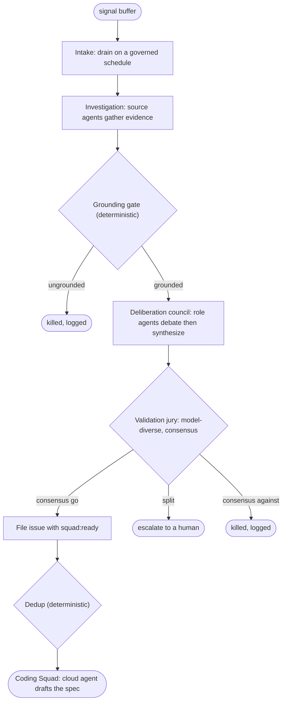

# Feature Council: Deliberative Council and Validation Jury (Design)

**Status:** Accepted (2026-06-19); recorded as ADR 0011. Plan 1 (validation jury, maturity-gated outcome policy, escalate outcome) is implemented in `docs/superpowers/plans/2026-06-19-feature-council-validation-jury.md`; the multi-round deliberation council and governed pull intake remain pending.

**Scope:** Re-architect the Feature Council's decision path. Replace the single
deterministic critic verdict (where any one critic holds a unilateral veto) with
a two-tier shape: a council of role-persona LLM agents that deliberate and
synthesize a recommendation, then a smaller, model-diverse jury that returns
go/no-go. Change intake from an optional synchronous push into a governed
scheduled pull. Keep deterministic gates for matters of fact (grounding,
de-duplication). This is a design charter for the decision path, not an
implementation plan. The plan follows once this is approved.

---

## 1. Problem

Today the council decides with deterministic critic functions. `council/decision.py`
runs each enabled critic, and `CouncilVerdict.from_scores` applies one rule: any
critic veto kills the proposal, otherwise a weighted score has to clear a
per-product threshold. Two problems follow:

- **A single agent reaches the verdict.** One critic's veto is enough to kill a
  proposal, and the verdict is one function's call with no deliberation and no
  diversity of perspective. The literature on LLM judging shows a lone judge is
  biased (self-enhancement and position effects), which is the failure mode this
  shape invites once critics become LLMs rather than fixed functions.
- **Intake can be pushed.** A synchronous ingestion path sits alongside the
  scheduled sweep, so an external source can drive the council's intake rate.
  That is an uncontrolled surface and an ungoverned cadence for a phase whose
  whole job is deliberate decision-making.

The goal is a decision path that argues before it decides, draws on more than one
perspective, separates the agent that proposes from the agents that judge, and
runs on a cadence the operator sets.

## 2. Principles

- **Facts stay deterministic, judgment gets deliberated.** Whether a claim
  traces to evidence, and whether an issue is a duplicate, are facts. They stay
  hard rules. Whether a proposal is worth building (value, cost, feasibility,
  security, strategic fit) is judgment. That gets debated and juried.
- **Separate the synthesizer from the judge.** The agents that deliberate a
  recommendation are not the agents that validate it. This avoids a model
  grading its own work.
- **Maturity is one dial, not a rebuild.** The pipeline does not change as the
  factory earns trust. Only the height of the human gates changes: how much
  consensus is needed to act without a person, and whether the spec auto-merges.

## 3. Target pipeline

## 4. Components

**Intake (changed).** Sources collect into a buffer (Event Grid then Service Bus,
per the charter). The council drains the buffer on a schedule it owns. The
synchronous push-into-the-pipeline path is removed from the council. Event-driven
urgency stays with the SRE incident fast-path, not here. Debounce is retained so
the same signal cannot start two runs in a window.

**Investigation (unchanged).** Dispatch the run's enabled source agents in
parallel and collect structured evidence. A degraded or disabled source
contributes nothing and says so. Coverage is never fabricated.

**Grounding gate (unchanged, deterministic).** Strip any claim that does not
trace to a real evidence item. A proposal left standing on nothing is killed.

**Deliberation council (new).** Role-persona agents, one per decision lens
(value, cost, feasibility, security, strategic fit), deliberate over one to two
see-and-revise rounds. Each agent states a position, reads the others, and
revises, with adversarial challenge built into the rounds. A synthesizer then
produces a single recommendation with rationale. This replaces the parallel
deterministic scoring in `council/decision.py` and folds in the synthesis step
that today lives at S3.

**Validation jury (new).** A smaller panel drawn from different model families,
separate from the deliberation tier, reads the recommendation and returns a
verdict with a consensus measure. Model diversity is where the bias reduction
comes from, so the jury must not be the same model that authored the
recommendation.

**Outcome policy (new).** A deterministic policy maps the jury's verdict and
consensus to an outcome: strong consensus to proceed, a split to escalate to a
human, consensus against to kill (logged to the decision trail). The thresholds
are set by the maturity level (section 6).

**Filing and dedup (mostly unchanged).** On proceed, file the issue with the
problem, the proposed change, the grounded evidence appendix, and the
`squad:ready` handoff label. Final de-duplication against already-filed issues
stays a deterministic rule.

**Spec authoring (boundary, out of scope here).** On proceed, a GitHub cloud
agent drafts the spec as the Coding Squad's opening move, merged automatically or
after human review per maturity. This lives at the phase boundary and is
specified with the Coding Squad, not in this document.

## 5. The jury decision rule

The jury returns one verdict per juror. A consensus measure (the fraction of
jurors agreeing on the majority side) drives the outcome:

- **Strong consensus to go:** proceed. At sufficient maturity this needs no
  human.
- **Split:** escalate to a human. A split is the signal that the case is genuinely
  contested, which is exactly what is worth a person's attention.
- **Consensus against:** kill, and log the decision with the jurors' rationales.

The bar that counts as "strong consensus" is not fixed. It is set by maturity, so
the same jury can advise at low maturity and decide at high maturity without
changing the panel.

## 6. Maturity gating

Maturity is a per-product, runtime-adjustable level that sets two gates and
nothing else:

- **Escalation bar:** how much jury consensus is needed to act without a human.
  At the low end, even a clean "go" routes to a person and the jury only advises.
  At the high end, only genuine splits escalate, and at the top nothing does.
- **Spec auto-merge:** whether the drafted spec merges automatically or waits for
  human review.

The rungs between those ends are deliberately left as a configured policy rather
than fixed in this design. The point is that raising autonomy is a setting, not a
re-architecture.

## 7. Research grounding

| Claim in this design | Source |
|---|---|
| A council of diverse agents that debate and revise beats a single reasoner on reasoning and factuality, and reduces hallucination. | Du et al. 2023, *Improving Factuality and Reasoning in Language Models through Multiagent Debate*, arXiv:2305.14325 |
| Multi-agent debate with distinct role personas works specifically for evaluation, not only generation. | Chan et al. 2023, *ChatEval: Towards Better LLM-based Evaluators through Multi-Agent Debate*, arXiv:2308.07201 |
| Layered aggregation (agents propose, a later layer synthesizes) improves quality and motivates separating deliberation from validation. | Wang et al. 2024, *Mixture-of-Agents Enhances Large Language Model Capabilities*, arXiv:2406.04692 |
| A single LLM judge is biased by self-enhancement and answer position, so one agent should not reach the verdict. | Zheng et al. 2023, *Judging LLM-as-a-Judge with MT-Bench and Chatbot Arena*, arXiv:2306.05685 |
| A panel of smaller, diverse judges beats a single large judge: less intra-model bias, cheaper, closer to human ratings, and panel disagreement flags ambiguous cases for human review. | Verga et al. 2024, *Replacing Judges with Juries: Evaluating LLM Generations with a Panel of Diverse Models*, arXiv:2404.18796 |

## 8. What changes against today

| Area | Today | Target |
|---|---|---|
| Intake | Scheduled sweep plus a synchronous push endpoint | Buffer drained on a governed schedule; no council push path |
| Synthesis | S3 clusters evidence into proposals | Folded into the deliberation council's synthesizer |
| Decision | Deterministic critics, any one vetoes, weighted score vs threshold | Role-persona debate then a model-diverse jury, consensus-driven outcome |
| Verdict authority | One function's call | Deliberation tier proposes, a separate jury decides |
| Grounding and dedup | Deterministic gates | Unchanged, deterministic gates |
| Human involvement | Implicit at merge | Explicit, set by the maturity escalation bar |

New modules are expected for the deliberation council, the jury, and the outcome
policy. The grounding and duplication critics are subsumed by the deterministic
gates that already exist (S4 grounding, S7 dedup), so they leave the debating
set. The debating lenses are value, cost, feasibility, security, and strategic
fit.

## 9. Harness and configuration

The existing per-product dials evolve rather than disappear:

- Critic enable/disable becomes lens enable/disable for the deliberation tier.
- Critic weights become each lens's influence in the debate and, where weighted,
  the jury.
- The per-product accept threshold becomes the consensus bar.
- New dials: the maturity level, the number of debate rounds, and the jury
  composition (size and model roster).

All stay per-product and adjustable while the line runs, consistent with
governing the factory rather than the assembly line.

## 10. Testing posture

The suite stays offline (ADR 0001, ADR 0005). Deliberation agents and jurors call
the model through the injected model port, so tests inject scripted agent and
juror outputs and assert on the pipeline's behavior with no network. The outcome
policy (consensus to proceed, escalate, or kill) is deterministic given juror
verdicts, so it is unit-tested directly. The grounding gate, dedup, and debounce
keep their existing deterministic tests.

## 11. Non-goals and deferred work

- Spec authoring by a cloud agent is a phase-boundary concern, specified with the
  Coding Squad.
- The SRE slow path that feeds operational signals back to the council stays
  deferred (ADR 0009).
- Enumerating every maturity rung is out of scope. Maturity is a policy seam here.
- The naming refresh for "feature council" remains a separate cross-cutting task.

## 12. Risks

- **Debate cost and latency.** Mitigated by the intake being scheduled and
  low-volume. Deciding features is not a high-frequency, latency-sensitive path.
- **Non-determinism in tests.** Mitigated by routing all model calls through the
  injected port and scripting outputs.
- **Correlated blind spots.** A jury drawn from one model family would share
  biases. Mitigated by requiring model diversity in the jury and keeping it
  separate from the deliberation tier.
- **Escalation volume at low maturity.** Frequent escalation at the low end is
  intended, not a defect. It is how the factory earns trust before the bar rises.

## 13. Open decisions (resolve in the plan)

- Exact consensus thresholds per maturity level, and the concrete rung
  definitions.
- Jury size and the model roster.
- Whether the synthesizer is a distinct agent or a role the deliberation council
  rotates.

## 14. Related

- Phase intent: [`docs/phases/feature-council.md`](../../phases/feature-council.md)
- Charter:
  [`2026-06-17-dark-software-factory-template-charter-design.md`](2026-06-17-dark-software-factory-template-charter-design.md)
- Decision record: [ADR 0011](../../adr/0011-feature-council-deliberative-redesign.md).
- Handoff contract: ADR 0007. SRE boundary: ADR 0009.
