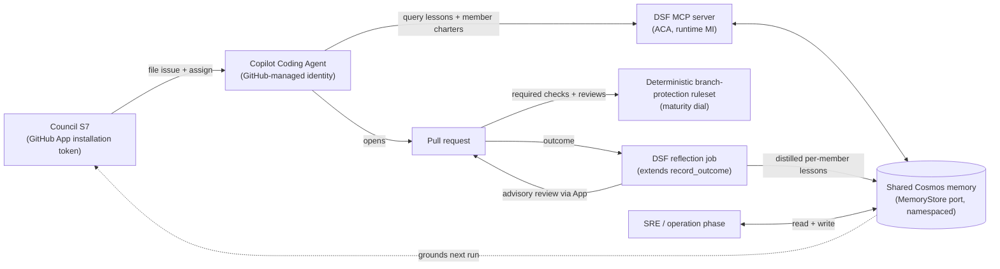

# Creation phase: Coding Agent as primary executor + DSF-owned reflection on a shared Cosmos memory

Date: 2026-06-22
Status: Draft (for review)
Supersedes: ADR 0012 (coding squad as a per-product Ralph watch loop on AKS + KEDA)
Relates to: #71 (this work), #73 (memory write policy, out of scope here), #54/#55/#56
(resolved/mooted), ADR 0007 (council->creation handoff label, kept), ADR 0004 (ACA runtime),
ADR 0006 (Azure data adapters), ADR 0011 (deliberative council), ADR 0014 (real-only `src/`)

## Goal

Make the **GitHub Copilot Coding Agent** the primary executor of the creation phase, retire
the Squad/Ralph-on-AKS harness, and move the reflection loop **into DSF** on the single
shared **Cosmos** memory that already backs the council. Every actor runs under a governed,
revocable **identity** — no PATs anywhere. Merge gates are **deterministic GitHub repo
controls**, never an LLM verdict.

This is the design behind #71. It resolves #54 by removing the operator PAT and replacing the
no-op governance with real branch-protection rulesets, and it moots #55/#56 by retiring the
AKS harness.

## Principles

1. **Identity, not tokens.** Every actor authenticates with a governed, revocable identity:
   the Coding Agent under GitHub's own managed identity, DSF->GitHub under a GitHub App
   installation token (short-lived, repo-scoped), DSF->Cosmos under an Entra managed
   identity. The single remaining secret is the App private key, which only mints scoped,
   ephemeral installation tokens and never grants code-write.
2. **Deterministic controls gate promotion.** Whether a Coding Agent pull request merges is
   decided by the repo's branch-protection ruleset (required status checks + required
   reviews), not by an LLM. LLM reflection grounds and iterates; it holds no merge authority.
3. **One substrate.** The council, the creation phase, and the operation/SRE phase read and
   write one shared Cosmos store, each in its own namespace.

## Architecture

The handoff label stays exactly as ADR 0007 defined it: S6 stamps
`dsf.contracts.handoff.HANDOFF_LABEL` (`squad:ready`) on every routed issue. Only the executor
behind the label changes — from `squad watch` to assign-to-Coding-Agent.

## Identity model

| Actor | Action | Identity (no PAT) |
| --- | --- | --- |
| Copilot Coding Agent | write code, open PR | GitHub-managed, ephemeral |
| DSF orchestration | file issue, assign, post advisory review | one **DSF GitHub App**, per-repo installation token |
| DSF provisioning | set branch-protection ruleset | operator's interactive **`gh`** auth (admin on the new repo) |
| DSF runtime <-> memory | read/write lessons + member history | Entra **managed identity** to Cosmos |

### One DSF GitHub App, one owner installation

A single owner/org-level **DSF GitHub App** is created **once**, interactively, via GitHub's
App-manifest flow (a one-time browser approval with a local callback to capture the
credentials). The App is installed **once** on the owner account (one installation). Each
`dsf new` then adds the product repo to that single installation via the API (no per-product
browser consent) and records the shared installation id on the instance manifest. Installation
access tokens are minted **scoped to just the product repo** — short-lived, revocable,
least-privilege — which is exactly the security property #71 asks for, without an interactive
browser dance on every provision. The App id + private key + installation id live in a
dedicated **owner-level Key Vault**; `dsf new` reads the private key from it to seed each
product Key Vault.

App permissions (least privilege): `issues:write` (file + assign), `pull_requests:write`
(advisory reviews), and `contents:read`. Branch-protection rulesets are applied separately
with the operator's interactive `gh` auth at provision time (the operator is admin on the
freshly created repo), so the App needs **no** `administration:write`. The Coding Agent must
be enabled on the repo so `copilot` is an assignable actor.

A new **real** `GitHubAppClient` lives in `core` (alongside `github_client.py`). It signs a
short-lived JWT with the App private key, exchanges it for an installation token, and exposes
its orchestration actions (file issue + assign now; advisory PR reviews land with the
reflection stage). Branch protection is **not** one of them — it is applied with the operator's
`gh` auth (above). The App id **and** installation id are both owner-level and
shared across products; each `dsf new` adds its product repo to that one installation and
stores the repo id on the instance manifest, so the runtime mints tokens scoped to just that
repo. The App **private key** is the one remaining secret: held in the owner Key Vault, seeded
into the product Key Vault at provision time, read by the runtime to mint tokens. It is defensible because it is not a bearer credential for the API — it only
signs requests that mint short-lived, narrowly-scoped installation tokens, and it is centrally
revocable/rotatable at the App.

At runtime, S7 selects its GitHub client in `build_services` (`_select_github_client`): it
**prefers the App client** (file the issue **and** assign the Coding Agent) and falls back to
the plain `gh`-CLI `GitHubClient` when no App is configured — the fallback files the issue
only (no Copilot assignment). Token minting fails closed: with the App configured the runtime
**requires** `GITHUB_REPOSITORY` so installation tokens are always scoped to the single product
repo (never all installation repos).

## Shared Cosmos memory + namespacing

The store is unchanged physically: one Cosmos DB per product (`database=<product>`) with the
`working` / `records` / `lessons` containers (`core/dsf/memory/azure_store.py`). We add a
logical **`namespace`** dimension carried on records and lessons:

- `council` — the council's consolidation + PR-outcome lessons (today's behavior).
- `coding/<member>` — each coding member's history slice (e.g. `coding/architect`).
- `operation` — the SRE/operation phase.

The `MemoryStore` port (`core/dsf/ports/__init__.py`) gains namespace-aware scoping; existing
un-namespaced council calls default to the `council` namespace, so nothing the council does
today changes. Because the current `CosmosGateway` only does single-field equality, namespaced
reads need a compound filter (kind/product + namespace); the gateway's `query` seam is widened
to accept that one extra equality, or the namespace is folded into the existing filtered key
(decided in the Stage 4 plan). The `Memory` wrapper (`core/dsf/memory/store.py`) grows a
`scoped(namespace)` helper so callers stay ergonomic.

**What gets written, and when, is deliberately not redesigned here.** #71 reuses the existing
write paths (`record_outcome` / `feedback_watcher` -> `Lesson`, `memory/consolidation.py`,
`memory/dedup.py`) and adds the namespace. The full write-policy reassessment — criteria,
timing, decay, curator mandate, and operator-facing docs — is tracked in **#73**.

## Coding members (personas, not executors)

The "members" are **lenses**, never separate executors (the Coding Agent is the one
executor; building another coding agent is a non-goal). Each member is a **charter** used two
ways: (a) injected as grounding via the MCP server so the single Coding Agent self-reviews
against it **before** opening the PR, and (b) a post-PR reflection lens that distills lessons
back into Cosmos.

The roster is six, mirroring how council critics are defined as config (a `coding-members`
block in `config/defaults.json`, enabled/weighted as runtime-governable config rather than
hard-coded):

| Member | Charter focus |
| --- | --- |
| Architect | system/design fit, boundaries, interfaces |
| Implementer | code quality, idioms, simplicity |
| Test-writer | coverage of the changed behavior |
| Security-reviewer | build-time security (distinct from the council's decide-time critic) |
| Docs-writer | documentation that ships with the change |
| Memory-curator (silent) | consolidate/dedup the coding namespace; never reviews the PR |

Each member's history is a namespaced slice (`coding/<member>`) of the shared Cosmos memory.
The taxonomy stays separate from the council's critics — deciding and building are different
concerns — but the storage layer is unified.

## MCP grounding server

A new **Cosmos-backed MCP server** runs in the existing ACA runtime under the runtime managed
identity (no new platform; reverses ADR 0012's two-runtime cost). It exposes read tools over
the shared `MemoryStore` — relevant **lessons** for the product/namespace and the **member
charters** — so the Coding Agent, which declares the server in its `mcp-servers` config, pulls
grounding at task start. This follows the first-class MCP pattern the source agents already use
(`feature-council/src/dsf/agents/{sentry,grafana,foundryiq}`).

## Reflection loop + deterministic merge gates

After the Coding Agent opens a PR, the **DSF reflection job** extends the existing
`record_outcome` / `feedback_watcher` path (`core/dsf/learning/`):

- It runs the member lenses and posts **advisory** PR reviews via the GitHub App. The Coding
  Agent may iterate on those comments. Reflection is advisory only.
- It distills per-member lessons into the namespaced Cosmos store (Memory-curator
  consolidates), so the next issue starts better-grounded.

**Merge is gated only by the deterministic branch-protection ruleset**, driven by the
**maturity dial** (renamed `squad_maturity` -> `creation_maturity`, CLI `--creation-maturity`,
since Squad is retired and the dial now means repo controls, not Ralph behavior):

- **low** — ruleset requires a human approval **and** the green required `ci` status check
  before merge. Coding Agent PRs wait for a human.
- **high** — auto-merge once the required `ci` status check passes; still deterministically
  CI-gated, no human required.

Both dials require a green status check named **`ci`** — a DSF convention the product CI must
publish (GitHub auto-merge for `high` cannot be enabled without at least one required check, so
the named check is structurally required).

The LLM never decides a merge. This is the proper fix for #54's governance no-op: the
provisioner sets a **real** branch-protection ruleset (named `dsf-creation`) instead of
toggling `allow_auto_merge`. It is applied with the operator's interactive `gh` auth at
provision time — not the App — and is idempotent (it updates the existing `dsf-creation`
ruleset in place).

## Provisioning changes (`dsf new`)

Removed steps: `squad_init`, `deploy_squad_ralph` (and the AKS `get-credentials` +
`kubectl apply` logic), and the squad token seed.

Added / changed steps:

- **GitHub App bootstrap** (one-time, interactive): create the DSF App via the manifest flow
  if it is not already configured; persist App id + private key.
- **Install App on the product repo** (per `dsf new`): create the installation, capture the
  installation id onto the instance manifest, seed the App private key into the product Key
  Vault.
- **Branch-protection ruleset** step (replaces `squad_governance`): apply the
  `creation_maturity` dial as a real `dsf-creation` ruleset (required reviews + green `ci`
  check) via the operator's interactive `gh` auth (admin on the new repo), so the App needs no
  `administration:write`. The ruleset JSON is passed on stdin (`gh api --input -`); the step is
  idempotent.
- **Deploy the MCP grounding server** as part of the ACA runtime bring-up.

`squad_render.py` and its tests are deleted.

## Infra changes (Bicep)

Removed from `infra/main.bicep` and modules: `infra/modules/aks.bicep`; `squadIdentity`,
`squadFederation`, `squadKvSecretsUser`, and the `github-token` Key Vault secret; the
`aksName` / `squadIdentityClientId` / `tenantId`(squad) outputs.

Added: a Key Vault secret for the App private key; runtime env wiring for the App id and
installation id; the MCP grounding server as a container in the ACA runtime. Runtime
consolidates to **ACA only**.

## Removes / resolves / moots

- **Removes** (ADR 0012 harness): per-product AKS cluster, the Ralph Deployment, the KEDA
  ScaledObject, the issue-exporter, the squad federated credential, and the `github-token`
  PAT in Key Vault.
- **Resolves #54**: no PAT anywhere; governance becomes a real branch-protection ruleset.
- **Moots #55/#56**: the issue-exporter stall and the public AKS API server disappear with
  the harness.

## Decomposition into staged implementation plans

Each stage is its own plan. Stage 1 is independent and unblocks everything; after it, two
tracks run roughly in parallel.

| Stage | Scope | Closes |
| --- | --- | --- |
| 1 | Retire AKS/Ralph harness + consolidate to ACA (pure removal) | #55, #56; removes the #54 PAT |
| 2 | `GitHubAppClient` (core) + App bootstrap/install in `dsf new` + KV private key | — |
| 3 | S7 file + assign-to-Coding-Agent under the App; deterministic branch-protection rulesets | #54 (with Stage 1) |
| 4 | Cosmos `namespace` dimension + the six member charters/history | — |
| 5 | Cosmos-backed MCP grounding server in ACA | — |
| 6 | DSF reflection job (extend `record_outcome`) — advisory reviews + namespaced lessons | — |
| 7 | ADR (this design) + concept/operate docs | — (completes #71) |

Dependency: 1 -> 2 -> 3 (identity/handoff track); 4 -> 5 and (4 + 2) -> 6 (memory/grounding/
reflection track).

## Testing strategy

Regular unit tests via `uv run pytest`, using the deterministic doubles in `dsf_testing`
(no network/Azure/GitHub calls):

- provisioner plan + command-batch assertions for the removals and the new App/ruleset steps;
- Bicep-render assertions that the squad/AKS resources and outputs are gone;
- `GitHubAppClient` token-minting with an injected runner + clock (JWT exchange, no live call);
- the namespaced `MemoryStore` via `dsf_testing` doubles (namespace isolation, council
  back-compat default);
- MCP server tool contracts (the grounding tools return the expected shapes).

Live GitHub/Copilot assignment and real ACA hosting are validated by a deployment, stated
plainly rather than claimed by the unit suite (consistent with ADR 0012's testing framing and
ADR 0014's real-only `src/`).

## Out of scope

- **Memory write policy** (what gets committed, when, decay, curator mandate, operator docs):
  **#73**.
- **Copilot Spaces**: a possible future **read-only** projection of Cosmos into a Space for
  native GitHub-side browsing. It is never the system-of-record, and because its write path
  wants a user PAT it stays out under the identity-not-tokens principle.
- Building a second coding agent or a second memory store: both are non-goals.
