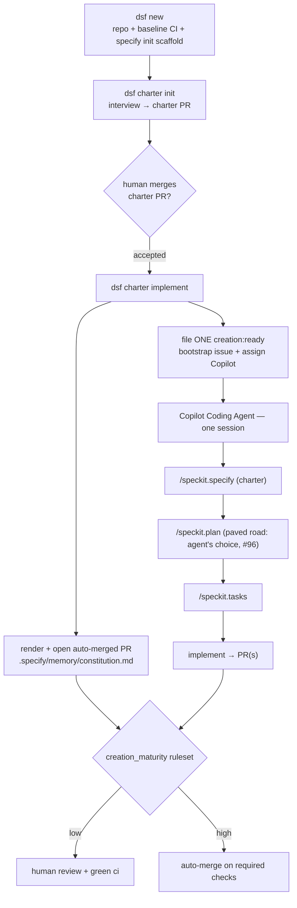

# Charter → Spec Kit greenfield seeding (`dsf charter implement`) — design

- Status: Approved (brainstorming)
- Date: 2026-06-29
- Issues: #96 (paved-road / tech-stack selection feeding `/speckit.plan`) and #97
  (maturity-gate the constitution PR's auto-merge) — deferred follow-ups created
  with this design
- Relates to: the Creation phase (`docs/site/concept/creation.md`), the Product
  Charter (`dsf charter init|sync|status`)
- ADRs: 0017 (product charter — human-owned intent), 0016 (creation phase on the
  Copilot Coding Agent), 0007 (council→creation handoff label `creation:ready`),
  0014 (real-only `src/`, pull-only), 0003 (two CLIs: `dsf` factory + runtime
  control)

## Problem

A freshly provisioned greenfield product has a human-owned **charter**
(`.dsf/charter.md`: vision, target users, goals, non-goals, success metrics,
constraints, glossary) but **no bridge from that intent to a built app**. Today
the only path from charter to code runs through the Feature Council: the council
sweeps source agents, deliberates over evidence, and files `creation:ready`
issues. That machinery exists to decide *what's worth building* when many signals
compete for limited capacity — a **day-2** problem.

Greenfield has no such competition. The charter **is** the decision. Routing a
brand-new product through evidence-gathering critics and votes is overhead with
nothing to weigh. What greenfield needs is a straight line: take the accepted
charter, decompose it into work, and hand that work to the executor DSF already
uses (the GitHub Copilot Coding Agent).

[GitHub Spec Kit](https://github.com/github/spec-kit) provides exactly that
decomposition as a lifecycle of agent commands — `/speckit.constitution`,
`/speckit.specify`, `/speckit.plan`, `/speckit.tasks`, `/speckit.implement` — and
its artifacts line up almost one-to-one with the charter. This design leans on
that lifecycle to seed and build a greenfield product from its charter, **without
the council**.

## Goal and scope

**Goal.** For greenfield products, go charter → built app by seeding the product
repo for Spec-Driven Development and letting the Copilot Coding Agent run the Spec
Kit lifecycle against the charter, reusing DSF's existing creation-phase governance
for the merges.

**In scope (this increment — the "front half"):**

1. Decorate `dsf new`'s repo seeding with `specify init` so every new product repo
   ships the Spec Kit scaffold.
2. A deterministic renderer that projects the merged charter into a Spec Kit
   **constitution**.
3. A new `dsf charter implement` subcommand that commits the constitution and
   files a single `creation:ready` **bootstrap issue** assigned to the Copilot
   Coding Agent.
4. Update the provisioning **prerequisites docs** for the new `specify-cli`
   dependency.

**Out of scope (deferred, tracked):**

- **Paved-road / tech-stack selection** feeding `/speckit.plan` — #96.
- Per-task issue fan-out (`/speckit.taskstoissues`) and dependency orchestration.
  v1 runs the whole lifecycle in **one agent session** instead.
- The deploy → URL → smoke-test → validate-faithful-to-intent → present loop (the
  eventual *outcome*; a separate, heavier build).
- Renaming the Feature Council → "Intent Council" for day-2 development.

## Principles

1. **Greenfield bypasses the council.** The council judges competing signals; the
   charter removes the competition. The seed flow is a deliberate, council-free
   path, not a shortcut.
2. **Charter stays the single human-owned source of truth (ADR 0017).** Agents
   never write the charter. Everything Spec Kit produces — constitution, specs,
   tasks, code — is a **derived artifact**, never the charter.
3. **Deterministic where it can be, model-driven where it must be.** The scaffold
   and the constitution are deterministic and offline-testable. The intent → user
   stories → plan → tasks decomposition inherently needs a model, so it runs
   **agent-side** (Copilot), keeping model calls out of DSF's provisioning hot
   path.
4. **DSF is the contract around the agent (ADR 0016).** DSF holds no
   code-writing credential. It seeds, renders, files the issue, and assigns; the
   Copilot Coding Agent does the building under GitHub's managed identity.
5. **Charter is untrusted data in prompts (ADR 0017).** Wherever the charter is
   embedded into an agent-facing prompt (the bootstrap issue body), it is wrapped
   in the `UNTRUSTED` envelope and treated as data, never instructions.

## End-to-end flow

1. **`dsf new`** — creates the GitHub repo, seeds the baseline `ci` workflow (as
   today), **and** runs `specify init --here --integration copilot --script sh` into the
   clone, committing the `.specify/` scaffold + Copilot command files in the same
   initial push.
2. **`dsf charter init`** — unchanged: interviews the owner, opens the
   `.dsf/charter.md` PR. A human reviews, edits, and **merges** it. Merging is the
   acceptance of intent.
3. **`dsf charter implement`** (new) — once the charter is merged/synced OK:
   renders `.specify/memory/constitution.md` from the charter and lands it via an
   **auto-merged PR** opened by the GitHub App (`main` is branch-protected, so a
   direct push is rejected — the charter itself uses the same PR path), then files
   **one** `creation:ready` bootstrap issue assigned to the Copilot Coding Agent.
4. **Copilot Coding Agent** (existing handoff) — in a single session with a large
   model, runs `/speckit.specify` (charter input) → `/speckit.plan` (paved road
   left to the agent for now) → `/speckit.tasks` → implements the tasks → opens
   PR(s).
5. **Existing governance** — the per-product maturity dial drives the
   `dsf-creation` branch-protection ruleset; the lessons/feedback loop records PR
   outcomes. Unchanged by this design.

## Lifecycle mapping

| Charter field | Spec Kit usage |
| --- | --- |
| `vision`, `target_users` | constitution preamble + `/speckit.specify` input |
| `constraints`, `non_goals`, `glossary` | constitution Core Principles / Additional Constraints |
| `goals`, `success_metrics` | prioritized user stories + quality gates |
| (deferred: paved road, #96) | `/speckit.plan` tech-stack input |

## Components and changes

Each unit has one clear purpose and a narrow interface.

### 1. `seed_repo` step — decorate with `specify init`

- **Where:** `cli/src/dsf/instance/provisioner.py` (the `seed_repo` step).
- **What:** in addition to the baseline `ci` workflow, run
  `specify init --here --integration copilot --script sh --ignore-agent-tools --force`
  in the repo clone and commit the resulting `.specify/` scaffold + Copilot command
  files with the initial push. `--here` targets the existing clone, `--script sh`
  picks the bash helpers, `--ignore-agent-tools` skips the local Copilot-CLI check
  (the seeding host only needs the scaffold), and `--force` skips the
  non-empty-directory confirmation. Because `specify init` writes many files, this
  step moves from
  the current single `gh api PUT contents` to a **clone → write → commit → push**
  flow.
- **Dependency:** `specify-cli` becomes an operator prerequisite, installed via
  `uv tool install specify-cli --from git+https://github.com/github/spec-kit.git@v0.11.9`.
  Templates are **bundled inside the `specify-cli` package** (verified against the
  locally installed `specify 0.11.9`, whose `init --help` states it "does not need
  network access and templates match the installed CLI version"): so **pinning the
  tag pins the templates** and makes seeding fully reproducible and offline.
- **Determinism / tests:** the provisioner records the command in dry-run and runs
  it under `--execute`, exactly like the existing `gh`/`az` steps. Unit tests assert
  the command list; no live `specify` run in the suite.

### 2. Constitution renderer (new, deterministic, pure)

- **Where:** `core/src/dsf/charter/` next to `markdown.py` (mirrors
  `render_charter`).
- **Interface:** `render_constitution(charter: Charter) -> str` → the markdown for
  `.specify/memory/constitution.md`.
- **Mapping:** see "Constitution mapping" below. Pure function, no I/O, no model.
  Round-trip-friendly and golden-testable offline.

### 3. `dsf charter implement` (new subcommand)

- **Where:** `cli/src/dsf/cli/charter.py` (joins `init` / `sync` / `status` under
  the `dsf charter` group).
- **Behaviour:**
  1. Resolve the product → repo via the registry; build only the real ports it
     needs (App client, charter store), per ADR 0014.
  2. Verify the charter is present and **synced OK** (reuse the `status` drift
     logic); refuse with a clear message if missing/invalid/stale so we never seed
     from a non-accepted charter.
  3. Render the constitution from the stored/merged charter and **land it via an
     auto-merged PR** opened by the GitHub App to `.specify/memory/constitution.md`
     (`open_file_pr(..., enable_auto_merge=True)`). A direct push to `main` is
     impossible — the `dsf-creation` ruleset requires a PR — so the constitution
     follows the same PR path the charter uses. At **high** maturity the repo has
     auto-merge on, so the PR self-merges on green `ci`; at **low** maturity
     auto-merge is off, so enabling it is a no-op and the PR waits for a human
     (the maturity-gated switch is tracked in #97). v1 always *requests* auto-merge.
  4. File **one** `creation:ready` bootstrap issue (body from the template below)
     and assign the Copilot Coding Agent via the existing App assignment path
     (`replaceActorsForAssignable`). If Copilot is not enabled on the repo, file
     the issue anyway and print an operator note (same fallback S7 uses).

### 4. Bootstrap issue template (new)

- **Where:** a DSF-authored template (e.g. `cli/src/dsf/instance/` alongside the
  other repo-seed text helpers).
- **Content:** a precise prompt that walks the agent through the **one-session**
  lifecycle — `/speckit.specify` from the charter, `/speckit.plan` (paved road is
  the agent's choice for now, referencing #96), `/speckit.tasks`, then implement —
  and points at `.dsf/charter.md` and `.specify/memory/constitution.md`. The
  charter is embedded as `UNTRUSTED` data (ADR 0017). The body **requests** a large
  model (e.g. Opus 4.8); see Risks for why this is a request, not a guarantee.

### 5. Documentation — provisioning prerequisites

- **Where:** `docs/site/get-started/provision-a-factory.md` (the `## Prerequisites`
  list) and `docs/site/get-started/quickstart.md`.
- **What:** add the pinned `specify-cli` install (`uv tool install specify-cli
  --from git+https://github.com/github/spec-kit.git@v0.11.9`) as a tool the
  principal running `dsf new` needs, and note that `dsf charter implement` follows a
  merged charter. Keeps the docs honest with the new external dependency.

## Constitution mapping (detail)

`render_constitution` projects the human-owned charter into the Spec Kit
constitution template (`# … Constitution` / `## Core Principles` /
`## Additional Constraints` / `## Governance`):

- **Preamble** ← `vision` + `target_users` (what the product is and who it serves).
- **Core Principles** ← `non_goals` (as explicit "we will not…" principles) and
  `glossary` (shared vocabulary the build must respect).
- **Additional Constraints** ← `constraints` (verbatim) — technology, compliance,
  and policy guardrails.
- **Quality gates / Governance** ← `goals` + `success_metrics` (what "done and
  faithful to intent" means).

The constitution is a **derived projection** of the charter: re-rendering it
introduces no new intent. Because `main` is branch-protected, `dsf charter
implement` lands it via an **auto-merged PR** (not a direct push) — the same PR
path the human-owned charter uses — so it merges without human review at high
maturity and waits for a human at low maturity (#97).

## Ownership and trust

- **Charter:** human-owned, agents never write it (ADR 0017) — unchanged.
- **Constitution:** DSF-rendered deterministically from the charter; landed via an
  **auto-merged PR** opened by the operator-invoked `dsf charter implement` (branch
  protection requires a PR; auto-merges at high maturity, human-merged at low — #97).
- **Specs / plan / tasks / code:** authored by the Copilot Coding Agent, governed
  by the existing maturity-dial merge path.
- **Prompt safety:** the charter is rendered into the bootstrap issue as
  `UNTRUSTED` data.

## Reuse (unchanged machinery)

The `creation:ready` handoff label, App-based Copilot assignment, the
`creation_maturity` → `dsf-creation` branch-protection ruleset, and the
lessons/feedback loop all carry the back half unchanged. This increment only adds
the front-half decomposition trigger.

## Testing

Offline/unit per DSF norms (`dsf_testing` doubles; no fakes in `src/`):

- **Provisioner:** assert the `specify init` command appears in the `seed_repo`
  plan/batch (dry-run), with the pinned tag and Copilot integration; no live run.
- **Constitution renderer:** golden-render test from a representative `Charter`;
  assert each charter field lands in the right constitution section; empty/optional
  fields render cleanly.
- **`dsf charter implement`:** drive it with `dsf_testing` doubles — assert it
  refuses on missing/invalid/stale charter, opens exactly one constitution PR with
  `enable_auto_merge=True` (App double records the PR + the auto-merge request),
  files exactly one `creation:ready` issue, and assigns Copilot (with the
  no-Copilot fallback note).
- **Boundaries:** `uv run lint-imports` stays green (no new cross-member imports;
  the renderer lives in `core`, the command and templates in `cli`).

## Risks and mitigations

- **Copilot model selection is not dictatable per-issue.** "Use Opus 4.8" is a
  Copilot repo/account setting; the bootstrap issue *requests* it. Mitigation:
  set it where the repo allows and state the request in the body.
- **`specify init` is a new operator prerequisite.** Mitigation: pin the
  specify-cli tag (templates are bundled in the package, so the scaffold is
  reproducible and needs no network at init); document the prerequisite in the
  provisioning docs; the unit suite asserts the command without running it live.
- **Single-session lifecycle reliability for large charters.** Acceptable for v1;
  the escape hatch is `/speckit.taskstoissues` fan-out + dependency orchestration
  (explicitly deferred).
- **Charter not merged when `dsf charter implement` runs.** Mitigated by the
  step-2 sync/drift check that refuses to seed from a non-accepted charter.

## Deferred work (tracked)

- Paved-road / tech-stack selection feeding `/speckit.plan` — **#96**.
- Maturity-gated constitution PR auto-merge (high = auto, low = human) — **#97**.
- Per-task issue fan-out + dependency orchestration via `/speckit.taskstoissues`.
- Deploy → URL → smoke-test → validate-faithful-to-intent → present loop.
- Feature Council → "Intent Council" rename for day-2 development.

## References

- GitHub Spec Kit — <https://github.com/github/spec-kit>
- `docs/site/concept/creation.md` — the Creation phase
- ADR 0017 (product charter), ADR 0016 (creation phase on the Copilot Coding
  Agent), ADR 0007 (`creation:ready` handoff), ADR 0014 (real-only `src/`),
  ADR 0003 (two CLIs)
